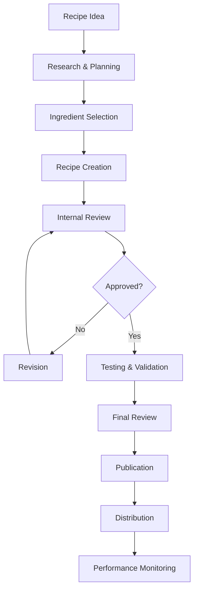
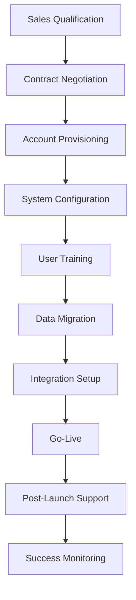
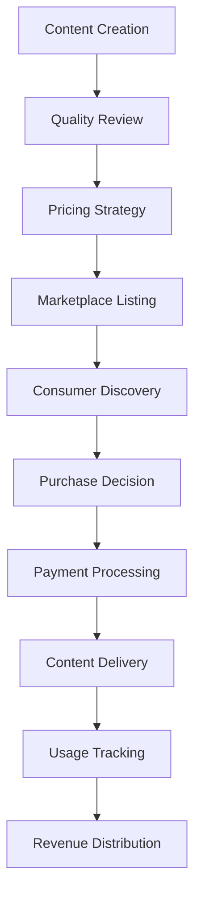

# Hestia Enterprise SaaS Platform - Business Requirements & Use Cases

## 📋 Document Information

| **Document Type**  | Business Requirements & Use Cases                                               |
| ------------------ | ------------------------------------------------------------------------------- |
| **Version**        | 2.0.0                                                                           |
| **Last Updated**   | December 28, 2024                                                               |
| **Next Review**    | February 28, 2025                                                               |
| **Document Owner** | Business Analysis Team                                                          |
| **Stakeholders**   | Product Management, Development Team, UX/UI Team, QA Team, Enterprise Customers |
| **Classification** | Requirements Specification Document                                             |
| **Status**         | Active - Under Development                                                      |

---

## 🎯 Executive Summary

This document defines the comprehensive business requirements and use cases for the Hestia Enterprise SaaS Platform. It serves as the foundation for all functional and non-functional requirements, ensuring alignment between business objectives and technical implementation while addressing the specific needs of enterprise customers across multiple industries.

### **Strategic Business Objectives**

1. **🏢 Streamline Enterprise Culinary Operations**: Provide comprehensive, enterprise-grade tools for recipe creation, management, distribution, and optimization
2. **🤝 Enable Global Collaboration**: Support team-based recipe development, content sharing, and cross-functional collaboration at scale
3. **💰 Drive Revenue Growth & Monetization**: Implement advanced monetization features, subscription management, and business intelligence
4. **🛡️ Ensure Enterprise Compliance**: Meet stringent enterprise security, privacy, regulatory, and audit requirements
5. **🌍 Support Global Expansion**: Enable comprehensive multi-language, multi-currency, multi-region, and multi-tenant operations
6. **🤖 Leverage AI & Intelligence**: Integrate advanced AI/ML capabilities for content optimization, recommendations, and predictive analytics
7. **📈 Optimize Business Performance**: Provide comprehensive analytics, reporting, and business intelligence for data-driven decision making
8. **🔗 Enable Ecosystem Integration**: Support extensive third-party integrations, API access, and platform extensibility

---

## 👥 Stakeholder Analysis

### **Primary Stakeholders**

#### **1. Enterprise Food & Beverage Companies**

- **Representatives**: Executive Leadership, Operations Managers, Chefs, Marketing Teams
- **Business Goals**:
  - Standardize recipe management across multiple locations
  - Reduce operational costs through efficient content management
  - Improve menu planning and customer satisfaction
  - Ensure compliance with food safety and nutritional regulations
- **Pain Points**:
  - Inconsistent recipe documentation across locations
  - Manual recipe sharing and version control
  - Limited collaboration between teams
  - Difficulty in scaling operations

#### **2. Educational Institutions**

- **Representatives**: Academic Directors, Faculty, Students, IT Administrators
- **Business Goals**:
  - Modernize culinary education with digital tools
  - Improve student engagement and learning outcomes
  - Streamline curriculum management and assessment
  - Enable remote and hybrid learning capabilities
- **Pain Points**:
  - Outdated paper-based recipe management
  - Limited digital collaboration tools
  - Difficulty in tracking student progress
  - Lack of industry-standard tools

#### **3. Healthcare & Nutrition Organizations**

- **Representatives**: Nutritionists, Dietitians, Healthcare Administrators, IT Teams
- **Business Goals**:
  - Improve patient meal planning and dietary compliance
  - Enhance clinical outcomes through better nutrition
  - Streamline dietary management workflows
  - Ensure regulatory compliance and documentation
- **Pain Points**:
  - Complex dietary restriction management
  - Manual meal planning processes
  - Limited integration with healthcare systems
  - Difficulty in tracking patient outcomes

#### **4. Media & Content Creators**

- **Representatives**: Content Creators, Publishers, Marketing Teams, Legal Teams
- **Business Goals**:
  - Monetize culinary content and intellectual property
  - Streamline content creation and distribution
  - Expand audience reach and engagement
  - Protect content rights and licensing
- **Pain Points**:
  - Fragmented content management systems
  - Limited monetization opportunities
  - Complex rights management
  - Difficulty in audience engagement

### **Secondary Stakeholders**

#### **5. IT Administrators & System Integrators**

- **Representatives**: IT Directors, System Administrators, Integration Specialists
- **Business Goals**:
  - Ensure system security and compliance
  - Integrate with existing enterprise systems
  - Maintain system performance and reliability
  - Support user adoption and training
- **Pain Points**:
  - Complex integration requirements
  - Security and compliance concerns
  - Limited API documentation and support
  - User training and adoption challenges

#### **6. End Users (Chefs, Nutritionists, Students)**

- **Representatives**: Individual users across all customer segments
- **Business Goals**:
  - Improve productivity and efficiency
  - Access high-quality culinary content
  - Collaborate with team members
  - Maintain professional development
- **Pain Points**:
  - Complex and unintuitive user interfaces
  - Limited mobile and offline capabilities
  - Poor search and discovery features
  - Lack of personalization and recommendations

---

## 🎯 Business Requirements

### **BR-001: Multi-Tenant Architecture**

**Requirement**: The system must support complete tenant isolation for enterprise customers.

**Business Justification**: Enterprise customers require complete data separation and custom branding capabilities.

**Acceptance Criteria**:

- Each tenant has isolated data storage and processing
- Custom branding and domain support for each tenant
- Tenant-specific configuration and feature enablement
- Cross-tenant data sharing is optional and controlled

**Priority**: High
**Effort**: High
**Risk**: Medium

### **BR-002: Role-Based Access Control**

**Requirement**: The system must implement granular role-based access control with 50+ permission types.

**Business Justification**: Enterprise customers need fine-grained control over user access and permissions.

**Acceptance Criteria**:

- Support for custom role creation and management
- 50+ granular permission types across all features
- Resource-level access control
- Audit logging for all permission changes

**Priority**: High
**Effort**: High
**Risk**: Medium

### **BR-003: Enterprise Authentication**

**Requirement**: The system must support enterprise SSO integration and multi-factor authentication.

**Business Justification**: Enterprise customers require integration with existing identity management systems.

**Acceptance Criteria**:

- SAML 2.0, OAuth 2.0, and OIDC support
- Multi-factor authentication (TOTP, SMS, Email)
- Active Directory and LDAP integration
- Session management and device tracking

**Priority**: High
**Effort**: High
**Risk**: Medium

### **BR-004: Recipe Management System**

**Requirement**: The system must provide comprehensive recipe creation, management, and distribution capabilities.

**Business Justification**: Core functionality for all customer segments to manage culinary content.

**Acceptance Criteria**:

- Rich recipe editor with media support
- Version control and collaboration features
- Advanced search and filtering capabilities
- Recipe sharing and distribution tools

**Priority**: Critical
**Effort**: High
**Risk**: Low

### **BR-005: Ingredient Management System**

**Requirement**: The system must provide comprehensive ingredient database and management capabilities.

**Business Justification**: Essential for recipe creation, nutritional analysis, and dietary compliance.

**Acceptance Criteria**:

- Global ingredient database with 10,000+ ingredients
- Nutritional information and allergen tracking
- Dietary classification and certification support
- Ingredient substitution and recommendation features

**Priority**: Critical
**Effort**: High
**Risk**: Low

### **BR-006: AI-Powered Intelligence**

**Requirement**: The system must implement AI-powered features for recommendations and content optimization.

**Business Justification**: Competitive differentiation and improved user experience through intelligent features.

**Acceptance Criteria**:

- Machine learning recommendation engine
- Natural language processing for content analysis
- Automated content tagging and categorization
- Predictive analytics for business insights

**Priority**: High
**Effort**: Very High
**Risk**: High

### **BR-007: Multi-Language Support**

**Requirement**: The system must support multiple languages with comprehensive translation capabilities.

**Business Justification**: Global market expansion and customer accessibility requirements.

**Acceptance Criteria**:

- Support for English and Arabic (expandable)
- Complete translation coverage for all content types
- RTL/LTR text direction support
- Fallback system for missing translations

**Priority**: High
**Effort**: High
**Risk**: Medium

### **BR-008: Subscription & Billing Management**

**Requirement**: The system must provide flexible subscription and billing management capabilities.

**Business Justification**: Revenue generation and customer lifecycle management.

**Acceptance Criteria**:

- Multiple subscription tiers and pricing models
- Usage-based billing and overage management
- Multi-currency and tax compliance support
- Payment processing and dunning management

**Priority**: High
**Effort**: High
**Risk**: Medium

### **BR-009: API Platform**

**Requirement**: The system must provide comprehensive API access for integrations and third-party development.

**Business Justification**: Enterprise integration requirements and ecosystem development.

**Acceptance Criteria**:

- RESTful APIs with 47+ endpoints
- GraphQL support for flexible queries
- Webhook system for real-time notifications
- Comprehensive API documentation and SDKs

**Priority**: High
**Effort**: High
**Risk**: Medium

### **BR-010: Business Intelligence & Analytics**

**Requirement**: The system must provide comprehensive analytics and reporting capabilities.

**Business Justification**: Data-driven decision making and business optimization.

**Acceptance Criteria**:

- Real-time analytics dashboard
- Custom report generation and scheduling
- Data export capabilities (CSV, Excel, PDF)
- Predictive analytics and trend analysis

**Priority**: Medium
**Effort**: High
**Risk**: Medium

---

## 🎯 Use Cases

### **UC-001: Enterprise Recipe Management**

#### **Primary Actor**: Enterprise Chef/Operations Manager

#### **Secondary Actors**: Team Members, IT Administrator, External Stakeholders

#### **Preconditions**:

- User has valid enterprise account with appropriate permissions
- System is configured for multi-tenant operation
- Recipe management features are enabled

#### **Main Success Scenario**:

1. **Login and Authentication**
   - User logs in through enterprise SSO
   - System validates credentials and permissions
   - User is redirected to tenant-specific dashboard

2. **Recipe Creation**
   - User navigates to recipe creation interface
   - System presents rich recipe editor with media support
   - User enters recipe details (title, description, ingredients, instructions)
   - System validates input and saves recipe draft

3. **Collaboration and Review**
   - User shares recipe with team members for review
   - System notifies team members of shared content
   - Team members provide feedback and suggestions
   - User incorporates feedback and finalizes recipe

4. **Publication and Distribution**
   - User publishes recipe to internal library
   - System generates recipe documentation and nutritional analysis
   - Recipe is made available to authorized team members
   - System tracks recipe usage and engagement metrics

#### **Extensions**:

- **2a**: User authentication fails
  - System displays error message and prompts for credentials
  - User retries authentication or contacts IT support
- **3a**: Recipe validation fails
  - System highlights validation errors
  - User corrects errors and resubmits
- **4a**: Publication fails due to permissions
  - System displays permission error
  - User requests appropriate permissions from administrator

#### **Postconditions**:

- Recipe is successfully created and published
- Team members have access to recipe content
- Recipe usage metrics are tracked
- Audit log records all actions

### **UC-002: Educational Curriculum Management**

#### **Primary Actor**: Academic Director/Faculty Member

#### **Secondary Actors**: Students, IT Administrator, Industry Partners

#### **Preconditions**:

- Educational institution has valid subscription
- Curriculum management features are enabled
- Student accounts are provisioned

#### **Main Success Scenario**:

1. **Curriculum Planning**
   - Academic director creates new curriculum module
   - System presents curriculum planning interface
   - Director defines learning objectives and requirements
   - System generates curriculum structure and timeline

2. **Content Development**
   - Faculty members create educational content
   - System supports multimedia content creation
   - Content is organized by learning objectives
   - System tracks content development progress

3. **Student Assignment and Tracking**
   - Faculty assigns content to student groups
   - System notifies students of assignments
   - Students access and complete assignments
   - System tracks student progress and performance

4. **Assessment and Feedback**
   - Faculty reviews student submissions
   - System provides assessment tools and rubrics
   - Faculty provides feedback and grades
   - System generates performance reports and analytics

#### **Extensions**:

- **1a**: Curriculum planning conflicts with existing modules
  - System identifies conflicts and suggests resolutions
  - Director adjusts curriculum plan accordingly
- **3a**: Student access issues
  - System logs access attempts and errors
  - IT administrator resolves access problems
- **4a**: Assessment submission fails
  - System preserves partial submissions
  - Student can resume and complete assessment

#### **Postconditions**:

- Curriculum is successfully implemented
- Students have access to educational content
- Performance metrics are tracked and reported
- Learning outcomes are measured and documented

### **UC-003: Healthcare Dietary Management**

#### **Primary Actor**: Nutritionist/Dietitian

#### **Secondary Actors**: Patients, Healthcare Administrators, IT Teams

#### **Preconditions**:

- Healthcare organization has valid subscription
- Dietary management features are enabled
- Patient data integration is configured

#### **Main Success Scenario**:

1. **Patient Assessment**
   - Nutritionist conducts patient dietary assessment
   - System captures dietary preferences and restrictions
   - Patient health data is integrated from healthcare systems
   - System generates dietary profile and recommendations

2. **Meal Planning**
   - Nutritionist creates personalized meal plans
   - System considers dietary restrictions and preferences
   - Meal plans include nutritional analysis and compliance
   - System generates shopping lists and preparation instructions

3. **Patient Engagement**
   - Patients access meal plans through mobile application
   - System provides interactive meal tracking and feedback
   - Patients log food intake and adherence
   - System tracks compliance and provides reminders

4. **Outcome Monitoring**
   - System analyzes patient adherence and outcomes
   - Nutritionist reviews progress and adjusts plans
   - System generates compliance and outcome reports
   - Healthcare administrators access aggregated analytics

#### **Extensions**:

- **1a**: Patient data integration fails
  - System logs integration errors
  - Nutritionist manually enters patient data
- **2a**: Dietary restriction conflicts
  - System identifies conflicts and suggests alternatives
  - Nutritionist adjusts meal plan accordingly
- **3a**: Patient non-compliance
  - System escalates to nutritionist for intervention
  - Nutritionist provides additional support and guidance

#### **Postconditions**:

- Patient receives personalized meal plan
- Dietary compliance is tracked and monitored
- Health outcomes are measured and reported
- Healthcare team has access to patient progress

### **UC-004: Content Monetization**

#### **Primary Actor**: Content Creator/Publisher

#### **Secondary Actors**: Consumers, Payment Processors, Legal Teams

#### **Preconditions**:

- Content creator has valid subscription with monetization features
- Payment processing is configured
- Content rights and licensing are established

#### **Main Success Scenario**:

1. **Content Creation and Preparation**
   - Creator develops high-quality culinary content
   - System provides content creation and editing tools
   - Creator adds metadata, tags, and licensing information
   - System validates content quality and completeness

2. **Pricing and Distribution**
   - Creator sets pricing and distribution parameters
   - System supports multiple pricing models (subscription, pay-per-view, licensing)
   - Content is published to marketplace or direct channels
   - System manages content discovery and promotion

3. **Consumer Access and Payment**
   - Consumers discover and purchase content
   - System processes payments and manages access
   - Consumers access content through various channels
   - System tracks usage and engagement metrics

4. **Revenue Management and Analytics**
   - System calculates and distributes revenue
   - Creator accesses revenue analytics and reporting
   - System manages tax compliance and reporting
   - Creator receives payments and financial statements

#### **Extensions**:

- **1a**: Content quality validation fails
  - System provides quality improvement suggestions
  - Creator revises content to meet quality standards
- **2a**: Pricing conflicts with marketplace policies
  - System identifies policy violations
  - Creator adjusts pricing to comply with policies
- **3a**: Payment processing fails
  - System preserves transaction data
  - Payment processor handles retry and resolution

#### **Postconditions**:

- Content is successfully monetized
- Revenue is calculated and distributed
- Consumer access is managed and tracked
- Creator receives compensation and analytics

### **UC-005: Enterprise Integration**

#### **Primary Actor**: IT Administrator/System Integrator

#### **Secondary Actors**: Development Team, Third-Party Vendors, End Users

#### **Preconditions**:

- Enterprise has valid subscription with API access
- Integration requirements are defined
- Security and compliance requirements are established

#### **Main Success Scenario**:

1. **Integration Planning**
   - IT administrator defines integration requirements
   - System provides API documentation and SDKs
   - Integration architecture is designed and approved
   - System supports integration testing and validation

2. **API Development and Testing**
   - Development team implements API integrations
   - System provides comprehensive API testing tools
   - Integrations are tested in development environment
   - System validates integration security and performance

3. **Deployment and Configuration**
   - Integrations are deployed to production environment
   - System manages configuration and environment variables
   - End users are trained on integrated workflows
   - System monitors integration performance and reliability

4. **Maintenance and Support**
   - System provides integration monitoring and alerting
   - IT administrator manages integration updates and maintenance
   - System supports troubleshooting and issue resolution
   - Integration performance and usage are tracked

#### **Extensions**:

- **1a**: Integration requirements exceed API capabilities
  - System escalates to development team for custom solutions
  - Development team implements required API extensions
- **2a**: Integration testing reveals security vulnerabilities
  - System blocks integration deployment
  - Development team addresses security issues
- **3a**: Integration deployment fails
  - System rolls back to previous configuration
  - IT administrator resolves deployment issues

#### **Postconditions**:

- Enterprise systems are successfully integrated
- End users can access integrated workflows
- Integration performance is monitored and optimized
- System supports ongoing maintenance and updates

---

## 🎯 Business Process Flows

### **BP-001: Recipe Development Workflow**

### **BP-002: Customer Onboarding Workflow**

### **BP-003: Content Monetization Workflow**

---

## 🎯 Business Rules

### **BR-001: User Authentication Rules**

- Users must authenticate through approved enterprise SSO or local authentication
- Multi-factor authentication is required for all administrative accounts
- Session timeouts are enforced based on user role and security requirements
- Failed authentication attempts are logged and may trigger account lockout

### **BR-002: Data Access Rules**

- Users can only access data within their assigned tenant
- Role-based permissions determine feature and data access
- Audit logging is required for all data access and modifications
- Data export is restricted based on user permissions and compliance requirements

### **BR-003: Content Management Rules**

- All content must pass quality validation before publication
- Version control is maintained for all content modifications
- Content ownership and licensing must be clearly defined
- Content can be shared based on user permissions and tenant policies

### **BR-004: Billing and Subscription Rules**

- Subscription tiers determine feature access and usage limits
- Overage charges apply when usage exceeds tier limits
- Payment processing follows PCI DSS compliance requirements
- Refund policies are applied based on subscription terms and usage

### **BR-005: Compliance and Security Rules**

- All data processing must comply with GDPR and local privacy laws
- Security incidents must be reported within 24 hours
- Data retention policies are enforced based on regulatory requirements
- Regular security audits and penetration testing are required

---

## 🎯 Success Criteria

### **Functional Success Criteria**

- All core features are implemented and functional
- System performance meets defined SLAs
- User adoption rates exceed 80% within 6 months
- Customer satisfaction scores exceed 90%

### **Business Success Criteria**

- Achieve $1M in ARR within 18 months
- Customer retention rates exceed 95%
- Market penetration in target segments exceeds 10%
- Strategic partnerships established with key industry players

### **Technical Success Criteria**

- System uptime exceeds 99.9%
- API response times are under 100ms (p95)
- Security compliance certifications achieved
- Integration success rate exceeds 95%

---

## 📚 Related Documentation & Resources

### **Core Documentation Suite**

- **[Project Overview & Vision](01_PROJECT_OVERVIEW_AND_VISION.md)**: Strategic vision, market analysis, and business objectives
- **[Feature Catalog & Specifications](03_FEATURE_CATALOG_AND_SPECIFICATIONS.md)**: Detailed feature specifications and acceptance criteria
- **[Technical Architecture & Design](04_TECHNICAL_ARCHITECTURE_AND_DESIGN.md)**: System architecture and technical design principles
- **[Domain Model & Entity Reference](05_DOMAIN_MODEL_AND_ENTITY_REFERENCE.md)**: Data models and entity relationships
- **[API & Integration Handbook](06_API_AND_INTEGRATION_HANDBOOK.md)**: API documentation and integration guidelines
- **[Security Compliance & Data Protection](07_SECURITY_COMPLIANCE_AND_DATA_PROTECTION.md)**: Security framework and compliance requirements

### **Implementation Documentation**

- **[Testing Strategy & Quality Assurance](09_TESTING_STRATEGY_AND_QUALITY_ASSURANCE.md)**: Testing framework and quality standards
- **[Technical Guidelines & Restrictions](10_TECHNICAL_GUIDELINES_AND_RESTRICTIONS.md)**: Development standards and code quality requirements
- **[Master Backlog](11_BACKLOG.md)**: Comprehensive development backlog and task management

---

## ✅ Document Acceptance Criteria

### **Requirements Quality**

- [ ] All business requirements are clearly defined and measurable
- [ ] Use cases are comprehensive and cover all user scenarios
- [ ] Acceptance criteria are specific and testable
- [ ] Business rules are documented and validated
- [ ] Success criteria are quantifiable and achievable

### **Stakeholder Alignment**

- [ ] All stakeholder needs are identified and addressed
- [ ] Requirements are validated with business stakeholders
- [ ] Use cases reflect real-world business scenarios
- [ ] Functional requirements align with business objectives
- [ ] Non-functional requirements meet enterprise standards

### **Traceability & Documentation**

- [ ] Requirements are traceable to business objectives
- [ ] Use cases are linked to specific requirements
- [ ] Dependencies are clearly identified and documented
- [ ] Change management processes are established
- [ ] Version control is properly maintained

### **Quality Standards**

- [ ] Document follows established formatting standards
- [ ] Content is accurate and up-to-date
- [ ] All cross-references are valid and functional
- [ ] Regular review and update schedules are established
- [ ] Feedback mechanisms are in place for continuous improvement

---

_This comprehensive business requirements and use cases document provides the foundation for the Hestia Enterprise SaaS Platform development, ensuring alignment between business objectives and technical implementation while meeting the specific needs of enterprise customers across multiple industries._

**Document Status**: ✅ Complete and Ready for Implementation  
**Next Review Date**: February 28, 2025  
**Version**: 2.0.0  
**Last Updated**: December 28, 2024
