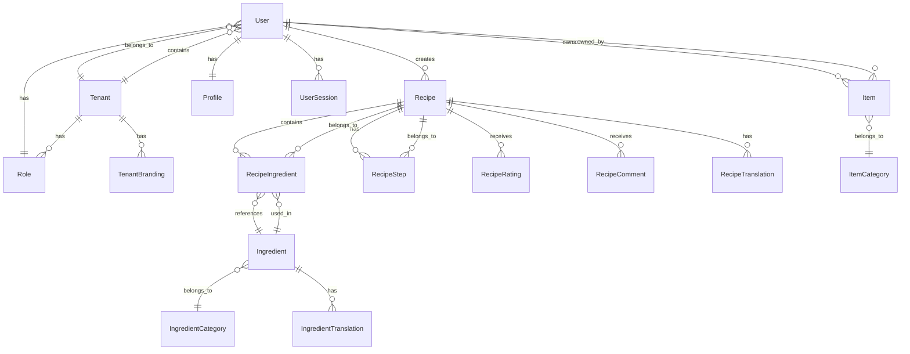

# Hestia Enterprise SaaS Platform - Domain Model & Entity Reference

## 📋 Document Information

| **Document Type** | Domain Model & Entity Reference |
|-------------------|----------------------------------|
| **Version** | 1.0.0 |
| **Last Updated** | December 28, 2024 |
| **Next Review** | January 28, 2025 |
| **Document Owner** | Domain Architecture Team |
| **Stakeholders** | Development Team, Business Analysts, Data Architects |
| **Classification** | Domain Design Document |

---

## 🎯 Executive Summary

This document defines the comprehensive domain model and entity reference for the Hestia Enterprise SaaS Platform. It follows Domain-Driven Design (DDD) principles with clear entity relationships, business rules, and data models that reflect the culinary domain expertise.

### **Domain Model Principles**
1. **Ubiquitous Language**: Consistent terminology across all stakeholders
2. **Bounded Contexts**: Clear boundaries between different domain areas
3. **Entity Relationships**: Well-defined associations and dependencies
4. **Business Rules**: Domain-specific validation and constraints
5. **Value Objects**: Immutable objects representing domain concepts
6. **Aggregates**: Transactional boundaries for data consistency

---

## 🏗️ Domain Model Overview

### **Core Domain Areas**

```
┌─────────────────────────────────────────────────────────────┐
│                    🏢 Enterprise Domain                     │
│  ┌─────────────────┐  ┌─────────────────┐  ┌─────────────┐ │
│  │   User Mgmt     │  │   Tenant Mgmt   │  │   Security  │ │
│  │                 │  │                 │  │             │ │
│  │ • User          │  │ • Tenant        │  │ • Role      │ │
│  │ • Profile       │  │ • Branding      │  │ • Permission│ │
│  │ • Session       │  │ • Configuration │  │ • Audit     │ │
│  └─────────────────┘  └─────────────────┘  └─────────────┘ │
└─────────────────────────────────────────────────────────────┘
                               ↕
┌─────────────────────────────────────────────────────────────┐
│                    🍳 Culinary Domain                       │
│  ┌─────────────────┐  ┌─────────────────┐  ┌─────────────┐ │
│  │   Recipe Mgmt   │  │  Ingredient Mgmt│  │   Content   │ │
│  │                 │  │                 │  │             │ │
│  │ • Recipe        │  │ • Ingredient    │  │ • Collection│ │
│  │ • Step          │  │ • Category      │  │ • Rating    │ │
│  │ • Instruction   │  │ • Nutritional   │  │ • Comment   │ │
│  └─────────────────┘  └─────────────────┘  └─────────────┘ │
└─────────────────────────────────────────────────────────────┘
                               ↕
┌─────────────────────────────────────────────────────────────┐
│                    📦 Personal Domain                       │
│  ┌─────────────────┐  ┌─────────────────┐  ┌─────────────┐ │
│  │   Item Mgmt     │  │   Inventory     │  │   Tracking  │ │
│  │                 │  │                 │  │             │ │
│  │ • Item          │  │ • Category      │  │ • Status    │ │
│  │ • Maintenance   │  │ • Location      │  │ • Value     │ │
│  │ • Warranty      │  │ • Supplier      │  │ • Analytics │ │
│  └─────────────────┘  └─────────────────┘  └─────────────┘ │
└─────────────────────────────────────────────────────────────┘
```

---

## 🏢 Enterprise Domain

### **User Management Aggregate**

#### **User Entity**
```typescript
@Entity('users')
export class User extends BaseEntity {
  @Column({ unique: true, length: 255 })
  email: string;

  @Column({ length: 255 })
  passwordHash: string;

  @Column({ type: 'enum', enum: Role, default: Role.USER })
  role: Role;

  @Column({ default: false })
  emailVerified: boolean;

  @Column({ nullable: true })
  lastLoginAt?: Date;

  @Column({ default: true })
  isActive: boolean;

  @Column({ type: 'uuid' })
  tenantId: string;

  // Relationships
  @OneToOne(() => Profile, profile => profile.user, { cascade: true })
  profile: Profile;

  @OneToMany(() => UserSession, session => session.user, { cascade: true })
  sessions: UserSession[];

  @OneToMany(() => Recipe, recipe => recipe.user)
  recipes: Recipe[];

  @OneToMany(() => Item, item => item.user)
  items: Item[];

  // Business Rules
  @BeforeInsert()
  @BeforeUpdate()
  validateEmail() {
    if (!isValidEmail(this.email)) {
      throw new Error('Invalid email format');
    }
  }

  @BeforeInsert()
  @BeforeUpdate()
  validatePassword() {
    if (this.passwordHash && this.passwordHash.length < 60) {
      throw new Error('Password must be properly hashed');
    }
  }

  // Domain Methods
  verifyEmail(): void {
    this.emailVerified = true;
    this.updatedAt = new Date();
  }

  updateLastLogin(): void {
    this.lastLoginAt = new Date();
    this.updatedAt = new Date();
  }

  deactivate(): void {
    this.isActive = false;
    this.updatedAt = new Date();
  }

  activate(): void {
    this.isActive = true;
    this.updatedAt = new Date();
  }
}
```

#### **Profile Value Object**
```typescript
@Entity('profiles')
export class Profile extends BaseEntity {
  @Column({ type: 'uuid' })
  userId: string;

  @Column({ length: 100 })
  firstName: string;

  @Column({ length: 100 })
  lastName: string;

  @Column({ nullable: true, length: 500 })
  bio?: string;

  @Column({ nullable: true, length: 500 })
  avatarUrl?: string;

  @Column({ type: 'jsonb', nullable: true })
  preferences: UserPreferences;

  @Column({ type: 'jsonb', nullable: true })
  dietaryRestrictions: DietaryRestriction[];

  @Column({ type: 'jsonb', nullable: true })
  skillLevel: SkillLevel;

  @Column({ nullable: true, length: 100 })
  location?: string;

  @Column({ nullable: true, length: 100 })
  timezone?: string;

  // Relationships
  @OneToOne(() => User, user => user.profile)
  @JoinColumn({ name: 'userId' })
  user: User;

  // Business Rules
  @BeforeInsert()
  @BeforeUpdate()
  validateName() {
    if (!this.firstName.trim() || !this.lastName.trim()) {
      throw new Error('First and last name are required');
    }
  }

  // Domain Methods
  getFullName(): string {
    return `${this.firstName} ${this.lastName}`;
  }

  updatePreferences(preferences: Partial<UserPreferences>): void {
    this.preferences = { ...this.preferences, ...preferences };
    this.updatedAt = new Date();
  }

  addDietaryRestriction(restriction: DietaryRestriction): void {
    if (!this.dietaryRestrictions) {
      this.dietaryRestrictions = [];
    }
    if (!this.dietaryRestrictions.find(r => r.type === restriction.type)) {
      this.dietaryRestrictions.push(restriction);
    }
    this.updatedAt = new Date();
  }
}
```

#### **UserSession Entity**
```typescript
@Entity('user_sessions')
export class UserSession extends BaseEntity {
  @Column({ type: 'uuid' })
  userId: string;

  @Column({ length: 255 })
  sessionToken: string;

  @Column({ length: 45 })
  ipAddress: string;

  @Column({ length: 500 })
  userAgent: string;

  @Column({ nullable: true, length: 100 })
  deviceId?: string;

  @Column({ nullable: true, length: 100 })
  deviceType?: string;

  @Column({ type: 'timestamp' })
  expiresAt: Date;

  @Column({ default: false })
  isActive: boolean;

  @Column({ nullable: true, type: 'timestamp' })
  lastActivityAt?: Date;

  // Relationships
  @ManyToOne(() => User, user => user.sessions)
  @JoinColumn({ name: 'userId' })
  user: User;

  // Business Rules
  @BeforeInsert()
  generateSessionToken() {
    this.sessionToken = crypto.randomBytes(32).toString('hex');
  }

  // Domain Methods
  isExpired(): boolean {
    return new Date() > this.expiresAt;
  }

  updateActivity(): void {
    this.lastActivityAt = new Date();
    this.updatedAt = new Date();
  }

  deactivate(): void {
    this.isActive = false;
    this.updatedAt = new Date();
  }
}
```

### **Tenant Management Aggregate**

#### **Tenant Entity**
```typescript
@Entity('tenants')
export class Tenant extends BaseEntity {
  @Column({ unique: true, length: 100 })
  name: string;

  @Column({ unique: true, length: 100 })
  subdomain: string;

  @Column({ nullable: true, length: 255 })
  customDomain?: string;

  @Column({ type: 'jsonb' })
  branding: TenantBranding;

  @Column({ type: 'jsonb' })
  configuration: TenantConfiguration;

  @Column({ type: 'jsonb' })
  features: TenantFeatures;

  @Column({ type: 'jsonb' })
  quotas: TenantQuotas;

  @Column({ default: true })
  isActive: boolean;

  @Column({ type: 'timestamp', nullable: true })
  trialEndsAt?: Date;

  @Column({ type: 'timestamp', nullable: true })
  subscriptionEndsAt?: Date;

  // Relationships
  @OneToMany(() => User, user => user.tenant)
  users: User[];

  // Business Rules
  @BeforeInsert()
  @BeforeUpdate()
  validateSubdomain() {
    if (!/^[a-z0-9-]+$/.test(this.subdomain)) {
      throw new Error('Subdomain must contain only lowercase letters, numbers, and hyphens');
    }
  }

  // Domain Methods
  isTrialExpired(): boolean {
    return this.trialEndsAt ? new Date() > this.trialEndsAt : false;
  }

  isSubscriptionExpired(): boolean {
    return this.subscriptionEndsAt ? new Date() > this.subscriptionEndsAt : false;
  }

  canAccessFeature(feature: string): boolean {
    return this.features[feature] === true;
  }

  updateBranding(branding: Partial<TenantBranding>): void {
    this.branding = { ...this.branding, ...branding };
    this.updatedAt = new Date();
  }
}
```

### **Security Aggregate**

#### **Role Entity**
```typescript
@Entity('roles')
export class Role extends BaseEntity {
  @Column({ length: 100 })
  name: string;

  @Column({ length: 500 })
  description: string;

  @Column({ type: 'uuid' })
  tenantId: string;

  @Column({ type: 'jsonb' })
  permissions: Permission[];

  @Column({ default: false })
  isSystem: boolean;

  @Column({ default: true })
  isActive: boolean;

  // Relationships
  @ManyToOne(() => Tenant, tenant => tenant.roles)
  @JoinColumn({ name: 'tenantId' })
  tenant: Tenant;

  @OneToMany(() => User, user => user.role)
  users: User[];

  // Business Rules
  @BeforeInsert()
  @BeforeUpdate()
  validatePermissions() {
    if (!Array.isArray(this.permissions) || this.permissions.length === 0) {
      throw new Error('Role must have at least one permission');
    }
  }

  // Domain Methods
  hasPermission(permission: Permission): boolean {
    return this.permissions.includes(permission);
  }

  addPermission(permission: Permission): void {
    if (!this.permissions.includes(permission)) {
      this.permissions.push(permission);
      this.updatedAt = new Date();
    }
  }

  removePermission(permission: Permission): void {
    this.permissions = this.permissions.filter(p => p !== permission);
    this.updatedAt = new Date();
  }
}
```

---

## 🍳 Culinary Domain

### **Recipe Management Aggregate**

#### **Recipe Entity**
```typescript
@Entity('recipes')
export class Recipe extends BaseEntity {
  @Column({ type: 'uuid' })
  userId: string;

  @Column({ length: 255 })
  title: string;

  @Column({ type: 'text', nullable: true })
  description?: string;

  @Column({ type: 'text' })
  instructions: string;

  @Column({ default: 0 })
  cookingTime: number;

  @Column({ default: 0 })
  prepTime: number;

  @Column({ default: 1 })
  servings: number;

  @Column({ type: 'enum', enum: Difficulty, default: Difficulty.MEDIUM })
  difficulty: Difficulty;

  @Column({ length: 50, nullable: true })
  cuisine?: string;

  @Column({ length: 50, nullable: true })
  category?: string;

  @Column({ type: 'text', array: true, default: [] })
  tags: string[];

  @Column({ length: 500, nullable: true })
  imageUrl?: string;

  @Column({ default: true })
  isPublic: boolean;

  @Column({ default: false })
  isPublished: boolean;

  @Column({ default: false })
  isVerified: boolean;

  @Column({ type: 'enum', enum: RecipeStatus, default: RecipeStatus.DRAFT })
  status: RecipeStatus;

  @Column({ type: 'jsonb', nullable: true })
  nutritionalInfo?: NutritionalInfo;

  @Column({ type: 'jsonb', nullable: true })
  dietaryInfo?: DietaryInfo;

  @Column({ type: 'timestamp', nullable: true })
  publishedAt?: Date;

  // Relationships
  @ManyToOne(() => User, user => user.recipes)
  @JoinColumn({ name: 'userId' })
  user: User;

  @OneToMany(() => RecipeIngredient, ingredient => ingredient.recipe, { cascade: true })
  ingredients: RecipeIngredient[];

  @OneToMany(() => RecipeStep, step => step.recipe, { cascade: true })
  steps: RecipeStep[];

  @OneToMany(() => RecipeRating, rating => rating.recipe)
  ratings: RecipeRating[];

  @OneToMany(() => RecipeComment, comment => comment.recipe)
  comments: RecipeComment[];

  @OneToMany(() => RecipeTranslation, translation => translation.recipe)
  translations: RecipeTranslation[];

  // Business Rules
  @BeforeInsert()
  @BeforeUpdate()
  validateRecipe() {
    if (!this.title.trim()) {
      throw new Error('Recipe title is required');
    }
    if (!this.instructions.trim()) {
      throw new Error('Recipe instructions are required');
    }
    if (this.cookingTime < 0 || this.prepTime < 0) {
      throw new Error('Time values cannot be negative');
    }
    if (this.servings < 1) {
      throw new Error('Servings must be at least 1');
    }
  }

  // Domain Methods
  getTotalTime(): number {
    return this.cookingTime + this.prepTime;
  }

  publish(): void {
    if (this.status !== RecipeStatus.DRAFT) {
      throw new Error('Only draft recipes can be published');
    }
    if (!this.isRecipeComplete()) {
      throw new Error('Recipe is incomplete and cannot be published');
    }
    
    this.status = RecipeStatus.PUBLISHED;
    this.isPublished = true;
    this.publishedAt = new Date();
    this.updatedAt = new Date();
  }

  private isRecipeComplete(): boolean {
    return this.ingredients && this.ingredients.length > 0 &&
           this.steps && this.steps.length > 0;
  }

  getAverageRating(): number {
    if (!this.ratings || this.ratings.length === 0) {
      return 0;
    }
    const totalRating = this.ratings.reduce((sum, rating) => sum + rating.rating, 0);
    return totalRating / this.ratings.length;
  }

  addTag(tag: string): void {
    if (!this.tags.includes(tag)) {
      this.tags.push(tag);
      this.updatedAt = new Date();
    }
  }

  removeTag(tag: string): void {
    this.tags = this.tags.filter(t => t !== tag);
    this.updatedAt = new Date();
  }
}
```

#### **RecipeIngredient Entity**
```typescript
@Entity('recipe_ingredients')
export class RecipeIngredient extends BaseEntity {
  @Column({ type: 'uuid' })
  recipeId: string;

  @Column({ type: 'uuid' })
  ingredientId: string;

  @Column({ type: 'decimal', precision: 10, scale: 2 })
  quantity: number;

  @Column({ length: 50 })
  unit: string;

  @Column({ length: 255, nullable: true })
  notes?: string;

  @Column({ type: 'jsonb', nullable: true })
  substitutions?: IngredientSubstitution[];

  @Column({ default: 1 })
  order: number;

  // Relationships
  @ManyToOne(() => Recipe, recipe => recipe.ingredients)
  @JoinColumn({ name: 'recipeId' })
  recipe: Recipe;

  @ManyToOne(() => Ingredient, ingredient => ingredient.recipeIngredients)
  @JoinColumn({ name: 'ingredientId' })
  ingredient: Ingredient;

  // Business Rules
  @BeforeInsert()
  @BeforeUpdate()
  validateQuantity() {
    if (this.quantity <= 0) {
      throw new Error('Quantity must be greater than 0');
    }
  }

  // Domain Methods
  getFormattedQuantity(): string {
    return `${this.quantity} ${this.unit}`;
  }

  addSubstitution(substitution: IngredientSubstitution): void {
    if (!this.substitutions) {
      this.substitutions = [];
    }
    this.substitutions.push(substitution);
    this.updatedAt = new Date();
  }
}
```

#### **RecipeStep Entity**
```typescript
@Entity('recipe_steps')
export class RecipeStep extends BaseEntity {
  @Column({ type: 'uuid' })
  recipeId: string;

  @Column({ type: 'text' })
  instruction: string;

  @Column({ default: 1 })
  order: number;

  @Column({ nullable: true })
  duration?: number;

  @Column({ length: 100, nullable: true })
  temperature?: string;

  @Column({ type: 'jsonb', nullable: true })
  tips?: string[];

  @Column({ length: 500, nullable: true })
  imageUrl?: string;

  // Relationships
  @ManyToOne(() => Recipe, recipe => recipe.steps)
  @JoinColumn({ name: 'recipeId' })
  recipe: Recipe;

  @OneToMany(() => RecipeStepTranslation, translation => translation.step)
  translations: RecipeStepTranslation[];

  // Business Rules
  @BeforeInsert()
  @BeforeUpdate()
  validateInstruction() {
    if (!this.instruction.trim()) {
      throw new Error('Step instruction is required');
    }
  }

  // Domain Methods
  addTip(tip: string): void {
    if (!this.tips) {
      this.tips = [];
    }
    if (!this.tips.includes(tip)) {
      this.tips.push(tip);
      this.updatedAt = new Date();
    }
  }
}
```

### **Ingredient Management Aggregate**

#### **Ingredient Entity**
```typescript
@Entity('ingredients')
export class Ingredient extends BaseEntity {
  @Column({ length: 255 })
  name: string;

  @Column({ type: 'text', nullable: true })
  description?: string;

  @Column({ type: 'uuid', nullable: true })
  categoryId?: string;

  @Column({ length: 500, nullable: true })
  imageUrl?: string;

  @Column({ type: 'jsonb', nullable: true })
  nutritionalInfo?: NutritionalInfo;

  @Column({ type: 'text', array: true, default: [] })
  allergens: string[];

  @Column({ type: 'text', array: true, default: [] })
  dietaryTypes: string[];

  @Column({ length: 50, nullable: true })
  seasonality?: string;

  @Column({ length: 100, nullable: true })
  origin?: string;

  @Column({ type: 'text', nullable: true })
  storageInstructions?: string;

  @Column({ length: 100, nullable: true })
  shelfLife?: string;

  @Column({ type: 'text', nullable: true })
  substitutions?: string;

  @Column({ type: 'jsonb', nullable: true })
  certifications?: IngredientCertification[];

  @Column({ default: true })
  isActive: boolean;

  // Relationships
  @ManyToOne(() => IngredientCategory, category => category.ingredients)
  @JoinColumn({ name: 'categoryId' })
  category: IngredientCategory;

  @OneToMany(() => RecipeIngredient, recipeIngredient => recipeIngredient.ingredient)
  recipeIngredients: RecipeIngredient[];

  @OneToMany(() => IngredientTranslation, translation => translation.ingredient)
  translations: IngredientTranslation[];

  // Business Rules
  @BeforeInsert()
  @BeforeUpdate()
  validateName() {
    if (!this.name.trim()) {
      throw new Error('Ingredient name is required');
    }
  }

  // Domain Methods
  hasAllergen(allergen: string): boolean {
    return this.allergens.includes(allergen);
  }

  addAllergen(allergen: string): void {
    if (!this.allergens.includes(allergen)) {
      this.allergens.push(allergen);
      this.updatedAt = new Date();
    }
  }

  removeAllergen(allergen: string): void {
    this.allergens = this.allergens.filter(a => a !== allergen);
    this.updatedAt = new Date();
  }

  hasDietaryType(type: string): boolean {
    return this.dietaryTypes.includes(type);
  }

  addDietaryType(type: string): void {
    if (!this.dietaryTypes.includes(type)) {
      this.dietaryTypes.push(type);
      this.updatedAt = new Date();
    }
  }

  getNutritionalValue(nutrient: string): number {
    return this.nutritionalInfo?.[nutrient] || 0;
  }
}
```

---

## 📦 Personal Domain

### **Item Management Aggregate**

#### **Item Entity**
```typescript
@Entity('items')
export class Item extends BaseEntity {
  @Column({ type: 'uuid' })
  userId: string;

  @Column({ length: 255 })
  name: string;

  @Column({ type: 'text', nullable: true })
  description?: string;

  @Column({ type: 'uuid', nullable: true })
  categoryId?: string;

  @Column({ type: 'enum', enum: ItemType, default: ItemType.OTHER })
  type: ItemType;

  @Column({ type: 'enum', enum: ItemStatus, default: ItemStatus.ACTIVE })
  status: ItemStatus;

  @Column({ type: 'enum', enum: Priority, default: Priority.MEDIUM })
  priority: Priority;

  @Column({ length: 100, nullable: true })
  sku?: string;

  @Column({ length: 100, nullable: true })
  barcode?: string;

  @Column({ length: 100, nullable: true })
  brand?: string;

  @Column({ length: 100, nullable: true })
  model?: string;

  @Column({ length: 100, nullable: true })
  serialNumber?: string;

  @Column({ type: 'timestamp', nullable: true })
  purchaseDate?: Date;

  @Column({ type: 'decimal', precision: 10, scale: 2, default: 0 })
  purchasePrice: number;

  @Column({ type: 'decimal', precision: 10, scale: 2, nullable: true })
  currentValue?: number;

  @Column({ type: 'enum', enum: Condition, default: Condition.GOOD })
  condition: Condition;

  @Column({ length: 255, nullable: true })
  location?: string;

  @Column({ type: 'jsonb', nullable: true })
  specifications?: Record<string, any>;

  @Column({ type: 'jsonb', nullable: true })
  maintenance?: MaintenanceInfo;

  @Column({ type: 'timestamp', nullable: true })
  warrantyExpiry?: Date;

  @Column({ length: 500, nullable: true })
  imageUrl?: string;

  // Relationships
  @ManyToOne(() => User, user => user.items)
  @JoinColumn({ name: 'userId' })
  user: User;

  @ManyToOne(() => ItemCategory, category => category.items)
  @JoinColumn({ name: 'categoryId' })
  category: ItemCategory;

  // Business Rules
  @BeforeInsert()
  @BeforeUpdate()
  validateItem() {
    if (!this.name.trim()) {
      throw new Error('Item name is required');
    }
    if (this.purchasePrice < 0) {
      throw new Error('Purchase price cannot be negative');
    }
    if (this.currentValue && this.currentValue < 0) {
      throw new Error('Current value cannot be negative');
    }
  }

  // Domain Methods
  isWarrantyExpired(): boolean {
    return this.warrantyExpiry ? new Date() > this.warrantyExpiry : false;
  }

  getAgeInDays(): number {
    if (!this.purchaseDate) {
      return 0;
    }
    const now = new Date();
    const diffTime = Math.abs(now.getTime() - this.purchaseDate.getTime());
    return Math.ceil(diffTime / (1000 * 60 * 60 * 24));
  }

  updateCondition(condition: Condition): void {
    this.condition = condition;
    this.updatedAt = new Date();
  }

  updateLocation(location: string): void {
    this.location = location;
    this.updatedAt = new Date();
  }

  scheduleMaintenance(maintenance: MaintenanceInfo): void {
    this.maintenance = maintenance;
    this.updatedAt = new Date();
  }

  isMaintenanceDue(): boolean {
    if (!this.maintenance?.nextMaintenanceDate) {
      return false;
    }
    return new Date() >= this.maintenance.nextMaintenanceDate;
  }
}
```

---

## 🌐 Localization Domain

### **Translation Management Aggregate**

#### **RecipeTranslation Entity**
```typescript
@Entity('recipe_translations')
export class RecipeTranslation extends BaseEntity {
  @Column({ type: 'uuid' })
  recipeId: string;

  @Column({ type: 'enum', enum: Locale, default: Locale.ENGLISH })
  locale: Locale;

  @Column({ length: 255 })
  title: string;

  @Column({ type: 'text', nullable: true })
  description?: string;

  @Column({ type: 'text' })
  instructions: string;

  // Relationships
  @ManyToOne(() => Recipe, recipe => recipe.translations)
  @JoinColumn({ name: 'recipeId' })
  recipe: Recipe;

  // Business Rules
  @BeforeInsert()
  @BeforeUpdate()
  validateTranslation() {
    if (!this.title.trim()) {
      throw new Error('Translated title is required');
    }
    if (!this.instructions.trim()) {
      throw new Error('Translated instructions are required');
    }
  }

  // Domain Methods
  getDirection(): string {
    return this.locale === Locale.ARABIC ? 'rtl' : 'ltr';
  }
}
```

---

## 📊 Entity Relationships

### **Primary Relationships**



### **Relationship Cardinalities**

| **Relationship** | **Type** | **Cardinality** | **Description** |
|------------------|----------|-----------------|-----------------|
| User → Recipe | One-to-Many | 1:N | User can create multiple recipes |
| User → Item | One-to-Many | 1:N | User can own multiple items |
| User → Profile | One-to-One | 1:1 | User has exactly one profile |
| User → UserSession | One-to-Many | 1:N | User can have multiple active sessions |
| User → Role | Many-to-One | N:1 | Multiple users can have the same role |
| User → Tenant | Many-to-One | N:1 | Multiple users belong to the same tenant |
| Recipe → RecipeIngredient | One-to-Many | 1:N | Recipe contains multiple ingredients |
| Recipe → RecipeStep | One-to-Many | 1:N | Recipe has multiple steps |
| Recipe → RecipeRating | One-to-Many | 1:N | Recipe can receive multiple ratings |
| Ingredient → RecipeIngredient | One-to-Many | 1:N | Ingredient can be used in multiple recipes |
| Ingredient → IngredientCategory | Many-to-One | N:1 | Multiple ingredients can belong to the same category |

---

## 🔒 Business Rules & Constraints

### **User Management Rules**
- Email addresses must be unique within a tenant
- Passwords must be properly hashed using bcrypt
- Users must belong to exactly one tenant
- Inactive users cannot create new content
- Email verification is required for certain operations

### **Recipe Management Rules**
- Recipe titles must be unique within a user's recipes
- Published recipes must have at least one ingredient and step
- Recipe difficulty must be appropriate for user permissions
- Recipe ratings must be between 1 and 5
- Recipe comments must not exceed 1000 characters

### **Ingredient Management Rules**
- Ingredient names must be unique within the global database
- Nutritional information must be validated for accuracy
- Allergen information must be comprehensive and accurate
- Ingredient substitutions must be practical and safe

### **Item Management Rules**
- Item names must be unique within a user's inventory
- Purchase prices cannot be negative
- Current values must be reasonable estimates
- Maintenance schedules must be realistic

### **Localization Rules**
- Translations must maintain the original meaning
- RTL languages must be properly formatted
- Fallback translations must be available
- Cultural adaptations must be appropriate

---

## 📋 Data Validation

### **Input Validation**
```typescript
// Validation decorators for entities
export class CreateRecipeDto {
  @IsString()
  @Length(1, 255)
  title: string;

  @IsOptional()
  @IsString()
  @MaxLength(1000)
  description?: string;

  @IsString()
  @MinLength(10)
  instructions: string;

  @IsNumber()
  @Min(0)
  @Max(1440)
  cookingTime: number;

  @IsNumber()
  @Min(0)
  @Max(1440)
  prepTime: number;

  @IsNumber()
  @Min(1)
  @Max(100)
  servings: number;

  @IsEnum(Difficulty)
  difficulty: Difficulty;

  @IsOptional()
  @IsString()
  @MaxLength(50)
  cuisine?: string;

  @IsOptional()
  @IsArray()
  @IsString({ each: true })
  @MaxLength(50, { each: true })
  tags?: string[];
}
```

### **Business Logic Validation**
```typescript
// Domain service validation
@Injectable()
export class RecipeValidationService {
  async validateRecipeCreation(recipeData: CreateRecipeDto, userId: string): Promise<ValidationResult> {
    const errors: string[] = [];

    // Check user permissions
    const user = await this.userRepository.findOne({ where: { id: userId } });
    if (!user.isActive) {
      errors.push('User account is not active');
    }

    // Check recipe complexity permissions
    if (recipeData.difficulty === Difficulty.EXPERT) {
      const hasExpertPermission = await this.checkExpertPermissions(userId);
      if (!hasExpertPermission) {
        errors.push('Expert recipes require special permissions');
      }
    }

    // Check ingredient availability
    if (recipeData.ingredients) {
      const unavailableIngredients = await this.checkIngredientAvailability(recipeData.ingredients);
      if (unavailableIngredients.length > 0) {
        errors.push(`Unavailable ingredients: ${unavailableIngredients.join(', ')}`);
      }
    }

    // Check for duplicate recipes
    const duplicate = await this.findDuplicateRecipe(recipeData, userId);
    if (duplicate) {
      errors.push('Similar recipe already exists');
    }

    return {
      isValid: errors.length === 0,
      errors
    };
  }
}
```

---

## 📚 Related Documents

- [01_PROJECT_OVERVIEW_AND_VISION.md](01_PROJECT_OVERVIEW_AND_VISION.md)
- [02_BUSINESS_REQUIREMENTS_AND_USE_CASES.md](02_BUSINESS_REQUIREMENTS_AND_USE_CASES.md)
- [03_FEATURE_CATALOG_AND_SPECIFICATIONS.md](03_FEATURE_CATALOG_AND_SPECIFICATIONS.md)
- [04_TECHNICAL_ARCHITECTURE_AND_DESIGN.md](04_TECHNICAL_ARCHITECTURE_AND_DESIGN.md)

---

*Document Version: 1.0.0*  
*Last Updated: December 28, 2024*  
*Status: Domain Design Document*  
*Next Review: January 28, 2025* 