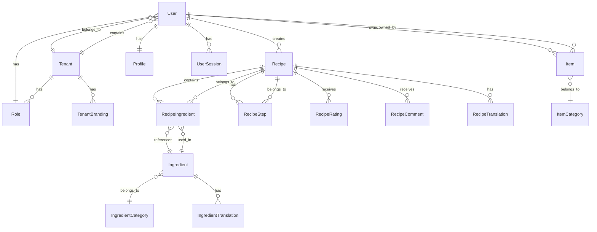

# Hestia Enterprise SaaS Platform - Domain Model & Entity Reference

## 📋 Document Information

| **Document Type**  | Domain Model & Entity Reference                                    |
| ------------------ | ------------------------------------------------------------------ |
| **Version**        | 2.0.0                                                              |
| **Last Updated**   | December 28, 2024                                                  |
| **Next Review**    | February 28, 2025                                                  |
| **Document Owner** | Domain Architecture Team                                           |
| **Stakeholders**   | Development Team, Business Analysts, Data Architects, Product Team |
| **Classification** | Domain Design Document                                             |
| **Status**         | Active - Under Development                                         |

---

## 🎯 Executive Summary

This document defines the comprehensive domain model and entity reference for the Hestia Enterprise SaaS Platform. It follows Domain-Driven Design (DDD) principles with clear entity relationships, business rules, and data models that reflect deep culinary domain expertise and enterprise requirements.

### **Domain Model Principles**

1. **🗣️ Ubiquitous Language**: Consistent terminology across all stakeholders and contexts
2. **🏗️ Bounded Contexts**: Clear boundaries between different domain areas with explicit integration patterns
3. **🔗 Rich Entity Relationships**: Well-defined associations, dependencies, and interaction patterns
4. **📋 Business Rules & Constraints**: Domain-specific validation, constraints, and business logic
5. **💎 Value Objects**: Immutable objects representing domain concepts with behavior
6. **🎯 Aggregates**: Transactional boundaries ensuring data consistency and business invariants
7. **🏢 Enterprise Patterns**: Multi-tenant, scalable, and enterprise-grade domain modeling
8. **🌍 Global Considerations**: Internationalization, localization, and cultural adaptation support

---

## 🏗️ Domain Model Overview

### **Core Domain Areas**

```
┌─────────────────────────────────────────────────────────────┐
│                    🏢 Enterprise Domain                     │
│  ┌─────────────────┐  ┌─────────────────┐  ┌─────────────┐ │
│  │   User Mgmt     │  │   Tenant Mgmt   │  │   Security  │ │
│  │                 │  │                 │  │             │ │
│  │ • User          │  │ • Tenant        │  │ • Role      │ │
│  │ • Profile       │  │ • Branding      │  │ • Permission│ │
│  │ • Session       │  │ • Configuration │  │ • Audit     │ │
│  └─────────────────┘  └─────────────────┘  └─────────────┘ │
└─────────────────────────────────────────────────────────────┘
                               ↕
┌─────────────────────────────────────────────────────────────┐
│                    🍳 Culinary Domain                       │
│  ┌─────────────────┐  ┌─────────────────┐  ┌─────────────┐ │
│  │   Recipe Mgmt   │  │  Ingredient Mgmt│  │   Content   │ │
│  │                 │  │                 │  │             │ │
│  │ • Recipe        │  │ • Ingredient    │  │ • Collection│ │
│  │ • Step          │  │ • Category      │  │ • Rating    │ │
│  │ • Instruction   │  │ • Nutritional   │  │ • Comment   │ │
│  └─────────────────┘  └─────────────────┘  └─────────────┘ │
└─────────────────────────────────────────────────────────────┘
                               ↕
┌─────────────────────────────────────────────────────────────┐
│                    📦 Personal Domain                       │
│  ┌─────────────────┐  ┌─────────────────┐  ┌─────────────┐ │
│  │   Item Mgmt     │  │   Inventory     │  │   Tracking  │ │
│  │                 │  │                 │  │             │ │
│  │ • Item          │  │ • Category      │  │ • Status    │ │
│  │ • Maintenance   │  │ • Location      │  │ • Value     │ │
│  │ • Warranty      │  │ • Supplier      │  │ • Analytics │ │
│  └─────────────────┘  └─────────────────┘  └─────────────┘ │
└─────────────────────────────────────────────────────────────┘
```

---

## 🏢 Enterprise Domain

### **User Management Aggregate**

#### **User Entity**

```typescript
@Entity('users')
export class User extends BaseEntity {
  @Column({ unique: true, length: 255 })
  email: string;

  @Column({ length: 255 })
  passwordHash: string;

  @Column({ type: 'enum', enum: Role, default: Role.USER })
  role: Role;

  @Column({ default: false })
  emailVerified: boolean;

  @Column({ nullable: true })
  lastLoginAt?: Date;

  @Column({ default: true })
  isActive: boolean;

  @Column({ type: 'uuid' })
  tenantId: string;

  // Relationships
  @OneToOne(() => Profile, profile => profile.user, { cascade: true })
  profile: Profile;

  @OneToMany(() => UserSession, session => session.user, { cascade: true })
  sessions: UserSession[];

  @OneToMany(() => Recipe, recipe => recipe.user)
  recipes: Recipe[];

  @OneToMany(() => Item, item => item.user)
  items: Item[];

  // Business Rules
  @BeforeInsert()
  @BeforeUpdate()
  validateEmail() {
    if (!isValidEmail(this.email)) {
      throw new Error('Invalid email format');
    }
  }

  @BeforeInsert()
  @BeforeUpdate()
  validatePassword() {
    if (this.passwordHash && this.passwordHash.length < 60) {
      throw new Error('Password must be properly hashed');
    }
  }

  // Domain Methods
  verifyEmail(): void {
    this.emailVerified = true;
    this.updatedAt = new Date();
  }

  updateLastLogin(): void {
    this.lastLoginAt = new Date();
    this.updatedAt = new Date();
  }

  deactivate(): void {
    this.isActive = false;
    this.updatedAt = new Date();
  }

  activate(): void {
    this.isActive = true;
    this.updatedAt = new Date();
  }
}
```

#### **Profile Value Object**

```typescript
@Entity('profiles')
export class Profile extends BaseEntity {
  @Column({ type: 'uuid' })
  userId: string;

  @Column({ length: 100 })
  firstName: string;

  @Column({ length: 100 })
  lastName: string;

  @Column({ nullable: true, length: 500 })
  bio?: string;

  @Column({ nullable: true, length: 500 })
  avatarUrl?: string;

  @Column({ type: 'jsonb', nullable: true })
  preferences: UserPreferences;

  @Column({ type: 'jsonb', nullable: true })
  dietaryRestrictions: DietaryRestriction[];

  @Column({ type: 'jsonb', nullable: true })
  skillLevel: SkillLevel;

  @Column({ nullable: true, length: 100 })
  location?: string;

  @Column({ nullable: true, length: 100 })
  timezone?: string;

  // Relationships
  @OneToOne(() => User, user => user.profile)
  @JoinColumn({ name: 'userId' })
  user: User;

  // Business Rules
  @BeforeInsert()
  @BeforeUpdate()
  validateName() {
    if (!this.firstName.trim() || !this.lastName.trim()) {
      throw new Error('First and last name are required');
    }
  }

  // Domain Methods
  getFullName(): string {
    return `${this.firstName} ${this.lastName}`;
  }

  updatePreferences(preferences: Partial<UserPreferences>): void {
    this.preferences = { ...this.preferences, ...preferences };
    this.updatedAt = new Date();
  }

  addDietaryRestriction(restriction: DietaryRestriction): void {
    if (!this.dietaryRestrictions) {
      this.dietaryRestrictions = [];
    }
    if (!this.dietaryRestrictions.find(r => r.type === restriction.type)) {
      this.dietaryRestrictions.push(restriction);
    }
    this.updatedAt = new Date();
  }
}
```

#### **UserSession Entity**

```typescript
@Entity('user_sessions')
export class UserSession extends BaseEntity {
  @Column({ type: 'uuid' })
  userId: string;

  @Column({ length: 255 })
  sessionToken: string;

  @Column({ length: 45 })
  ipAddress: string;

  @Column({ length: 500 })
  userAgent: string;

  @Column({ nullable: true, length: 100 })
  deviceId?: string;

  @Column({ nullable: true, length: 100 })
  deviceType?: string;

  @Column({ type: 'timestamp' })
  expiresAt: Date;

  @Column({ default: false })
  isActive: boolean;

  @Column({ nullable: true, type: 'timestamp' })
  lastActivityAt?: Date;

  // Relationships
  @ManyToOne(() => User, user => user.sessions)
  @JoinColumn({ name: 'userId' })
  user: User;

  // Business Rules
  @BeforeInsert()
  generateSessionToken() {
    this.sessionToken = crypto.randomBytes(32).toString('hex');
  }

  // Domain Methods
  isExpired(): boolean {
    return new Date() > this.expiresAt;
  }

  updateActivity(): void {
    this.lastActivityAt = new Date();
    this.updatedAt = new Date();
  }

  deactivate(): void {
    this.isActive = false;
    this.updatedAt = new Date();
  }
}
```

### **Tenant Management Aggregate**

#### **Tenant Entity**

```typescript
@Entity('tenants')
export class Tenant extends BaseEntity {
  @Column({ unique: true, length: 100 })
  name: string;

  @Column({ unique: true, length: 100 })
  subdomain: string;

  @Column({ nullable: true, length: 255 })
  customDomain?: string;

  @Column({ type: 'jsonb' })
  branding: TenantBranding;

  @Column({ type: 'jsonb' })
  configuration: TenantConfiguration;

  @Column({ type: 'jsonb' })
  features: TenantFeatures;

  @Column({ type: 'jsonb' })
  quotas: TenantQuotas;

  @Column({ default: true })
  isActive: boolean;

  @Column({ type: 'timestamp', nullable: true })
  trialEndsAt?: Date;

  @Column({ type: 'timestamp', nullable: true })
  subscriptionEndsAt?: Date;

  // Relationships
  @OneToMany(() => User, user => user.tenant)
  users: User[];

  // Business Rules
  @BeforeInsert()
  @BeforeUpdate()
  validateSubdomain() {
    if (!/^[a-z0-9-]+$/.test(this.subdomain)) {
      throw new Error('Subdomain must contain only lowercase letters, numbers, and hyphens');
    }
  }

  // Domain Methods
  isTrialExpired(): boolean {
    return this.trialEndsAt ? new Date() > this.trialEndsAt : false;
  }

  isSubscriptionExpired(): boolean {
    return this.subscriptionEndsAt ? new Date() > this.subscriptionEndsAt : false;
  }

  canAccessFeature(feature: string): boolean {
    return this.features[feature] === true;
  }

  updateBranding(branding: Partial<TenantBranding>): void {
    this.branding = { ...this.branding, ...branding };
    this.updatedAt = new Date();
  }
}
```

### **Security Aggregate**

#### **Role Entity**

```typescript
@Entity('roles')
export class Role extends BaseEntity {
  @Column({ length: 100 })
  name: string;

  @Column({ length: 500 })
  description: string;

  @Column({ type: 'uuid' })
  tenantId: string;

  @Column({ type: 'jsonb' })
  permissions: Permission[];

  @Column({ default: false })
  isSystem: boolean;

  @Column({ default: true })
  isActive: boolean;

  // Relationships
  @ManyToOne(() => Tenant, tenant => tenant.roles)
  @JoinColumn({ name: 'tenantId' })
  tenant: Tenant;

  @OneToMany(() => User, user => user.role)
  users: User[];

  // Business Rules
  @BeforeInsert()
  @BeforeUpdate()
  validatePermissions() {
    if (!Array.isArray(this.permissions) || this.permissions.length === 0) {
      throw new Error('Role must have at least one permission');
    }
  }

  // Domain Methods
  hasPermission(permission: Permission): boolean {
    return this.permissions.includes(permission);
  }

  addPermission(permission: Permission): void {
    if (!this.permissions.includes(permission)) {
      this.permissions.push(permission);
      this.updatedAt = new Date();
    }
  }

  removePermission(permission: Permission): void {
    this.permissions = this.permissions.filter(p => p !== permission);
    this.updatedAt = new Date();
  }
}
```

---

## 🍳 Culinary Domain

### **Recipe Management Aggregate**

#### **Recipe Entity**

```typescript
@Entity('recipes')
export class Recipe extends BaseEntity {
  @Column({ type: 'uuid' })
  userId: string;

  @Column({ length: 255 })
  title: string;

  @Column({ type: 'text', nullable: true })
  description?: string;

  @Column({ type: 'text' })
  instructions: string;

  @Column({ default: 0 })
  cookingTime: number;

  @Column({ default: 0 })
  prepTime: number;

  @Column({ default: 1 })
  servings: number;

  @Column({ type: 'enum', enum: Difficulty, default: Difficulty.MEDIUM })
  difficulty: Difficulty;

  @Column({ length: 50, nullable: true })
  cuisine?: string;

  @Column({ length: 50, nullable: true })
  category?: string;

  @Column({ type: 'text', array: true, default: [] })
  tags: string[];

  @Column({ length: 500, nullable: true })
  imageUrl?: string;

  @Column({ default: true })
  isPublic: boolean;

  @Column({ default: false })
  isPublished: boolean;

  @Column({ default: false })
  isVerified: boolean;

  @Column({ type: 'enum', enum: RecipeStatus, default: RecipeStatus.DRAFT })
  status: RecipeStatus;

  @Column({ type: 'jsonb', nullable: true })
  nutritionalInfo?: NutritionalInfo;

  @Column({ type: 'jsonb', nullable: true })
  dietaryInfo?: DietaryInfo;

  @Column({ type: 'timestamp', nullable: true })
  publishedAt?: Date;

  // Relationships
  @ManyToOne(() => User, user => user.recipes)
  @JoinColumn({ name: 'userId' })
  user: User;

  @OneToMany(() => RecipeIngredient, ingredient => ingredient.recipe, { cascade: true })
  ingredients: RecipeIngredient[];

  @OneToMany(() => RecipeStep, step => step.recipe, { cascade: true })
  steps: RecipeStep[];

  @OneToMany(() => RecipeRating, rating => rating.recipe)
  ratings: RecipeRating[];

  @OneToMany(() => RecipeComment, comment => comment.recipe)
  comments: RecipeComment[];

  @OneToMany(() => RecipeTranslation, translation => translation.recipe)
  translations: RecipeTranslation[];

  // Business Rules
  @BeforeInsert()
  @BeforeUpdate()
  validateRecipe() {
    if (!this.title.trim()) {
      throw new Error('Recipe title is required');
    }
    if (!this.instructions.trim()) {
      throw new Error('Recipe instructions are required');
    }
    if (this.cookingTime < 0 || this.prepTime < 0) {
      throw new Error('Time values cannot be negative');
    }
    if (this.servings < 1) {
      throw new Error('Servings must be at least 1');
    }
  }

  // Domain Methods
  getTotalTime(): number {
    return this.cookingTime + this.prepTime;
  }

  publish(): void {
    if (this.status !== RecipeStatus.DRAFT) {
      throw new Error('Only draft recipes can be published');
    }
    if (!this.isRecipeComplete()) {
      throw new Error('Recipe is incomplete and cannot be published');
    }

    this.status = RecipeStatus.PUBLISHED;
    this.isPublished = true;
    this.publishedAt = new Date();
    this.updatedAt = new Date();
  }

  private isRecipeComplete(): boolean {
    return this.ingredients && this.ingredients.length > 0 && this.steps && this.steps.length > 0;
  }

  getAverageRating(): number {
    if (!this.ratings || this.ratings.length === 0) {
      return 0;
    }
    const totalRating = this.ratings.reduce((sum, rating) => sum + rating.rating, 0);
    return totalRating / this.ratings.length;
  }

  addTag(tag: string): void {
    if (!this.tags.includes(tag)) {
      this.tags.push(tag);
      this.updatedAt = new Date();
    }
  }

  removeTag(tag: string): void {
    this.tags = this.tags.filter(t => t !== tag);
    this.updatedAt = new Date();
  }
}
```

#### **RecipeIngredient Entity**

```typescript
@Entity('recipe_ingredients')
export class RecipeIngredient extends BaseEntity {
  @Column({ type: 'uuid' })
  recipeId: string;

  @Column({ type: 'uuid' })
  ingredientId: string;

  @Column({ type: 'decimal', precision: 10, scale: 2 })
  quantity: number;

  @Column({ length: 50 })
  unit: string;

  @Column({ length: 255, nullable: true })
  notes?: string;

  @Column({ type: 'jsonb', nullable: true })
  substitutions?: IngredientSubstitution[];

  @Column({ default: 1 })
  order: number;

  // Relationships
  @ManyToOne(() => Recipe, recipe => recipe.ingredients)
  @JoinColumn({ name: 'recipeId' })
  recipe: Recipe;

  @ManyToOne(() => Ingredient, ingredient => ingredient.recipeIngredients)
  @JoinColumn({ name: 'ingredientId' })
  ingredient: Ingredient;

  // Business Rules
  @BeforeInsert()
  @BeforeUpdate()
  validateQuantity() {
    if (this.quantity <= 0) {
      throw new Error('Quantity must be greater than 0');
    }
  }

  // Domain Methods
  getFormattedQuantity(): string {
    return `${this.quantity} ${this.unit}`;
  }

  addSubstitution(substitution: IngredientSubstitution): void {
    if (!this.substitutions) {
      this.substitutions = [];
    }
    this.substitutions.push(substitution);
    this.updatedAt = new Date();
  }
}
```

#### **RecipeStep Entity**

```typescript
@Entity('recipe_steps')
export class RecipeStep extends BaseEntity {
  @Column({ type: 'uuid' })
  recipeId: string;

  @Column({ type: 'text' })
  instruction: string;

  @Column({ default: 1 })
  order: number;

  @Column({ nullable: true })
  duration?: number;

  @Column({ length: 100, nullable: true })
  temperature?: string;

  @Column({ type: 'jsonb', nullable: true })
  tips?: string[];

  @Column({ length: 500, nullable: true })
  imageUrl?: string;

  // Relationships
  @ManyToOne(() => Recipe, recipe => recipe.steps)
  @JoinColumn({ name: 'recipeId' })
  recipe: Recipe;

  @OneToMany(() => RecipeStepTranslation, translation => translation.step)
  translations: RecipeStepTranslation[];

  // Business Rules
  @BeforeInsert()
  @BeforeUpdate()
  validateInstruction() {
    if (!this.instruction.trim()) {
      throw new Error('Step instruction is required');
    }
  }

  // Domain Methods
  addTip(tip: string): void {
    if (!this.tips) {
      this.tips = [];
    }
    if (!this.tips.includes(tip)) {
      this.tips.push(tip);
      this.updatedAt = new Date();
    }
  }
}
```

### **Ingredient Management Aggregate**

#### **Ingredient Entity**

```typescript
@Entity('ingredients')
export class Ingredient extends BaseEntity {
  @Column({ length: 255 })
  name: string;

  @Column({ type: 'text', nullable: true })
  description?: string;

  @Column({ type: 'uuid', nullable: true })
  categoryId?: string;

  @Column({ length: 500, nullable: true })
  imageUrl?: string;

  @Column({ type: 'jsonb', nullable: true })
  nutritionalInfo?: NutritionalInfo;

  @Column({ type: 'text', array: true, default: [] })
  allergens: string[];

  @Column({ type: 'text', array: true, default: [] })
  dietaryTypes: string[];

  @Column({ length: 50, nullable: true })
  seasonality?: string;

  @Column({ length: 100, nullable: true })
  origin?: string;

  @Column({ type: 'text', nullable: true })
  storageInstructions?: string;

  @Column({ length: 100, nullable: true })
  shelfLife?: string;

  @Column({ type: 'text', nullable: true })
  substitutions?: string;

  @Column({ type: 'jsonb', nullable: true })
  certifications?: IngredientCertification[];

  @Column({ default: true })
  isActive: boolean;

  // Relationships
  @ManyToOne(() => IngredientCategory, category => category.ingredients)
  @JoinColumn({ name: 'categoryId' })
  category: IngredientCategory;

  @OneToMany(() => RecipeIngredient, recipeIngredient => recipeIngredient.ingredient)
  recipeIngredients: RecipeIngredient[];

  @OneToMany(() => IngredientTranslation, translation => translation.ingredient)
  translations: IngredientTranslation[];

  // Business Rules
  @BeforeInsert()
  @BeforeUpdate()
  validateName() {
    if (!this.name.trim()) {
      throw new Error('Ingredient name is required');
    }
  }

  // Domain Methods
  hasAllergen(allergen: string): boolean {
    return this.allergens.includes(allergen);
  }

  addAllergen(allergen: string): void {
    if (!this.allergens.includes(allergen)) {
      this.allergens.push(allergen);
      this.updatedAt = new Date();
    }
  }

  removeAllergen(allergen: string): void {
    this.allergens = this.allergens.filter(a => a !== allergen);
    this.updatedAt = new Date();
  }

  hasDietaryType(type: string): boolean {
    return this.dietaryTypes.includes(type);
  }

  addDietaryType(type: string): void {
    if (!this.dietaryTypes.includes(type)) {
      this.dietaryTypes.push(type);
      this.updatedAt = new Date();
    }
  }

  getNutritionalValue(nutrient: string): number {
    return this.nutritionalInfo?.[nutrient] || 0;
  }
}
```

---

## 📦 Personal Domain

### **Item Management Aggregate**

#### **Item Entity**

```typescript
@Entity('items')
export class Item extends BaseEntity {
  @Column({ type: 'uuid' })
  userId: string;

  @Column({ length: 255 })
  name: string;

  @Column({ type: 'text', nullable: true })
  description?: string;

  @Column({ type: 'uuid', nullable: true })
  categoryId?: string;

  @Column({ type: 'enum', enum: ItemType, default: ItemType.OTHER })
  type: ItemType;

  @Column({ type: 'enum', enum: ItemStatus, default: ItemStatus.ACTIVE })
  status: ItemStatus;

  @Column({ type: 'enum', enum: Priority, default: Priority.MEDIUM })
  priority: Priority;

  @Column({ length: 100, nullable: true })
  sku?: string;

  @Column({ length: 100, nullable: true })
  barcode?: string;

  @Column({ length: 100, nullable: true })
  brand?: string;

  @Column({ length: 100, nullable: true })
  model?: string;

  @Column({ length: 100, nullable: true })
  serialNumber?: string;

  @Column({ type: 'timestamp', nullable: true })
  purchaseDate?: Date;

  @Column({ type: 'decimal', precision: 10, scale: 2, default: 0 })
  purchasePrice: number;

  @Column({ type: 'decimal', precision: 10, scale: 2, nullable: true })
  currentValue?: number;

  @Column({ type: 'enum', enum: Condition, default: Condition.GOOD })
  condition: Condition;

  @Column({ length: 255, nullable: true })
  location?: string;

  @Column({ type: 'jsonb', nullable: true })
  specifications?: Record<string, any>;

  @Column({ type: 'jsonb', nullable: true })
  maintenance?: MaintenanceInfo;

  @Column({ type: 'timestamp', nullable: true })
  warrantyExpiry?: Date;

  @Column({ length: 500, nullable: true })
  imageUrl?: string;

  // Relationships
  @ManyToOne(() => User, user => user.items)
  @JoinColumn({ name: 'userId' })
  user: User;

  @ManyToOne(() => ItemCategory, category => category.items)
  @JoinColumn({ name: 'categoryId' })
  category: ItemCategory;

  // Business Rules
  @BeforeInsert()
  @BeforeUpdate()
  validateItem() {
    if (!this.name.trim()) {
      throw new Error('Item name is required');
    }
    if (this.purchasePrice < 0) {
      throw new Error('Purchase price cannot be negative');
    }
    if (this.currentValue && this.currentValue < 0) {
      throw new Error('Current value cannot be negative');
    }
  }

  // Domain Methods
  isWarrantyExpired(): boolean {
    return this.warrantyExpiry ? new Date() > this.warrantyExpiry : false;
  }

  getAgeInDays(): number {
    if (!this.purchaseDate) {
      return 0;
    }
    const now = new Date();
    const diffTime = Math.abs(now.getTime() - this.purchaseDate.getTime());
    return Math.ceil(diffTime / (1000 * 60 * 60 * 24));
  }

  updateCondition(condition: Condition): void {
    this.condition = condition;
    this.updatedAt = new Date();
  }

  updateLocation(location: string): void {
    this.location = location;
    this.updatedAt = new Date();
  }

  scheduleMaintenance(maintenance: MaintenanceInfo): void {
    this.maintenance = maintenance;
    this.updatedAt = new Date();
  }

  isMaintenanceDue(): boolean {
    if (!this.maintenance?.nextMaintenanceDate) {
      return false;
    }
    return new Date() >= this.maintenance.nextMaintenanceDate;
  }
}
```

---

## 🛒 Shopping List Management Domain

### **Shopping List Management Aggregate**

#### **ShoppingList Entity**

```typescript
@Entity('shopping_lists')
export class ShoppingList extends BaseEntity {
  @Column({ type: 'uuid' })
  userId: string;

  @Column({ length: 255 })
  name: string;

  @Column({ type: 'text', nullable: true })
  description?: string;

  @Column({ type: 'enum', enum: ShoppingListStatus, default: ShoppingListStatus.ACTIVE })
  status: ShoppingListStatus;

  @Column({ type: 'enum', enum: ShoppingListVisibility, default: ShoppingListVisibility.PRIVATE })
  visibility: ShoppingListVisibility;

  @Column({ type: 'timestamp', nullable: true })
  plannedDate?: Date;

  @Column({ type: 'timestamp', nullable: true })
  completedDate?: Date;

  @Column({ type: 'decimal', precision: 10, scale: 2, default: 0 })
  estimatedBudget: number;

  @Column({ type: 'decimal', precision: 10, scale: 2, default: 0 })
  actualSpent: number;

  @Column({ type: 'jsonb', nullable: true })
  storePreferences?: StorePreference[];

  @Column({ type: 'jsonb', nullable: true })
  sharingSettings?: SharingSettings;

  @Column({ length: 255, nullable: true })
  shareUrl?: string;

  @Column({ type: 'uuid', nullable: true })
  recipeId?: string;

  // Relationships
  @ManyToOne(() => User, user => user.shoppingLists)
  @JoinColumn({ name: 'userId' })
  user: User;

  @OneToMany(() => ShoppingListItem, item => item.shoppingList, { cascade: true })
  items: ShoppingListItem[];

  @ManyToOne(() => Recipe, recipe => recipe.shoppingLists)
  @JoinColumn({ name: 'recipeId' })
  recipe: Recipe;

  @OneToMany(() => ShoppingListCollaborator, collaborator => collaborator.shoppingList)
  collaborators: ShoppingListCollaborator[];

  // Business Rules
  @BeforeInsert()
  @BeforeUpdate()
  validateName() {
    if (!this.name.trim()) {
      throw new Error('Shopping list name is required');
    }
  }

  // Domain Methods
  addItem(item: ShoppingListItem): void {
    if (!this.items) {
      this.items = [];
    }
    this.items.push(item);
    this.updatedAt = new Date();
  }

  removeItem(itemId: string): void {
    this.items = this.items.filter(item => item.id !== itemId);
    this.updatedAt = new Date();
  }

  markAsCompleted(): void {
    this.status = ShoppingListStatus.COMPLETED;
    this.completedDate = new Date();
    this.updatedAt = new Date();
  }

  calculateTotalEstimatedCost(): number {
    return this.items?.reduce((total, item) => total + (item.estimatedCost || 0), 0) || 0;
  }

  calculateTotalActualCost(): number {
    return this.items?.reduce((total, item) => total + (item.actualCost || 0), 0) || 0;
  }

  generateShareUrl(): string {
    this.shareUrl = `${process.env.APP_URL}/shopping-lists/${this.id}/share/${crypto.randomBytes(16).toString('hex')}`;
    return this.shareUrl;
  }
}
```

#### **ShoppingListItem Entity**

```typescript
@Entity('shopping_list_items')
export class ShoppingListItem extends BaseEntity {
  @Column({ type: 'uuid' })
  shoppingListId: string;

  @Column({ length: 255 })
  name: string;

  @Column({ type: 'text', nullable: true })
  description?: string;

  @Column({ type: 'decimal', precision: 10, scale: 2, default: 1 })
  quantity: number;

  @Column({ length: 50, nullable: true })
  unit?: string;

  @Column({ type: 'enum', enum: ItemPriority, default: ItemPriority.MEDIUM })
  priority: ItemPriority;

  @Column({ type: 'enum', enum: ItemStatus, default: ItemStatus.PENDING })
  status: ItemStatus;

  @Column({ type: 'decimal', precision: 10, scale: 2, nullable: true })
  estimatedCost?: number;

  @Column({ type: 'decimal', precision: 10, scale: 2, nullable: true })
  actualCost?: number;

  @Column({ length: 100, nullable: true })
  brand?: string;

  @Column({ length: 100, nullable: true })
  store?: string;

  @Column({ type: 'text', array: true, default: [] })
  notes: string[];

  @Column({ type: 'jsonb', nullable: true })
  substitutions?: string[];

  @Column({ type: 'uuid', nullable: true })
  ingredientId?: string;

  @Column({ type: 'uuid', nullable: true })
  recipeId?: string;

  // Relationships
  @ManyToOne(() => ShoppingList, shoppingList => shoppingList.items)
  @JoinColumn({ name: 'shoppingListId' })
  shoppingList: ShoppingList;

  @ManyToOne(() => Ingredient, ingredient => ingredient.shoppingListItems)
  @JoinColumn({ name: 'ingredientId' })
  ingredient: Ingredient;

  @ManyToOne(() => Recipe, recipe => recipe.shoppingListItems)
  @JoinColumn({ name: 'recipeId' })
  recipe: Recipe;

  // Business Rules
  @BeforeInsert()
  @BeforeUpdate()
  validateQuantity() {
    if (this.quantity <= 0) {
      throw new Error('Quantity must be greater than 0');
    }
  }

  // Domain Methods
  markAsPurchased(): void {
    this.status = ItemStatus.PURCHASED;
    this.updatedAt = new Date();
  }

  markAsUnavailable(): void {
    this.status = ItemStatus.UNAVAILABLE;
    this.updatedAt = new Date();
  }

  addNote(note: string): void {
    if (!this.notes) {
      this.notes = [];
    }
    this.notes.push(note);
    this.updatedAt = new Date();
  }

  addSubstitution(substitution: string): void {
    if (!this.substitutions) {
      this.substitutions = [];
    }
    this.substitutions.push(substitution);
    this.updatedAt = new Date();
  }

  getFormattedQuantity(): string {
    return `${this.quantity} ${this.unit || ''}`.trim();
  }
}
```

#### **ShoppingListCollaborator Entity**

```typescript
@Entity('shopping_list_collaborators')
export class ShoppingListCollaborator extends BaseEntity {
  @Column({ type: 'uuid' })
  shoppingListId: string;

  @Column({ type: 'uuid' })
  userId: string;

  @Column({ type: 'enum', enum: CollaboratorRole, default: CollaboratorRole.VIEWER })
  role: CollaboratorRole;

  @Column({ type: 'timestamp', nullable: true })
  invitedAt?: Date;

  @Column({ type: 'timestamp', nullable: true })
  acceptedAt?: Date;

  @Column({ default: false })
  isActive: boolean;

  // Relationships
  @ManyToOne(() => ShoppingList, shoppingList => shoppingList.collaborators)
  @JoinColumn({ name: 'shoppingListId' })
  shoppingList: ShoppingList;

  @ManyToOne(() => User, user => user.shoppingListCollaborations)
  @JoinColumn({ name: 'userId' })
  user: User;

  // Business Rules
  @BeforeInsert()
  @BeforeUpdate()
  validateCollaboration() {
    if (this.shoppingListId && this.userId) {
      // Prevent duplicate collaborations
      // This would be handled at the service level
    }
  }

  // Domain Methods
  acceptInvitation(): void {
    this.acceptedAt = new Date();
    this.isActive = true;
    this.updatedAt = new Date();
  }

  deactivate(): void {
    this.isActive = false;
    this.updatedAt = new Date();
  }

  canEdit(): boolean {
    return this.role === CollaboratorRole.EDITOR || this.role === CollaboratorRole.OWNER;
  }

  canDelete(): boolean {
    return this.role === CollaboratorRole.OWNER;
  }
}
```

---

## 📊 Analytics & Reporting Domain

### **Analytics Aggregate**

#### **AnalyticsEvent Entity**

```typescript
@Entity('analytics_events')
export class AnalyticsEvent extends BaseEntity {
  @Column({ type: 'uuid' })
  userId: string;

  @Column({ type: 'uuid', nullable: true })
  tenantId?: string;

  @Column({ length: 100 })
  eventType: string;

  @Column({ length: 100 })
  eventCategory: string;

  @Column({ type: 'jsonb' })
  eventData: Record<string, any>;

  @Column({ length: 45, nullable: true })
  ipAddress?: string;

  @Column({ length: 500, nullable: true })
  userAgent?: string;

  @Column({ length: 100, nullable: true })
  sessionId?: string;

  @Column({ type: 'timestamp' })
  occurredAt: Date;

  // Relationships
  @ManyToOne(() => User, user => user.analyticsEvents)
  @JoinColumn({ name: 'userId' })
  user: User;

  @ManyToOne(() => Tenant, tenant => tenant.analyticsEvents)
  @JoinColumn({ name: 'tenantId' })
  tenant: Tenant;

  // Business Rules
  @BeforeInsert()
  @BeforeUpdate()
  validateEventData() {
    if (!this.eventType || !this.eventCategory) {
      throw new Error('Event type and category are required');
    }
  }

  // Domain Methods
  getEventSummary(): string {
    return `${this.eventCategory}:${this.eventType}`;
  }

  isUserEvent(): boolean {
    return this.eventCategory === 'user';
  }

  isRecipeEvent(): boolean {
    return this.eventCategory === 'recipe';
  }

  isIngredientEvent(): boolean {
    return this.eventCategory === 'ingredient';
  }
}
```

#### **AnalyticsMetric Entity**

```typescript
@Entity('analytics_metrics')
export class AnalyticsMetric extends BaseEntity {
  @Column({ type: 'uuid', nullable: true })
  tenantId?: string;

  @Column({ length: 100 })
  metricName: string;

  @Column({ length: 100 })
  metricCategory: string;

  @Column({ type: 'decimal', precision: 15, scale: 4 })
  value: number;

  @Column({ length: 50, nullable: true })
  unit?: string;

  @Column({ type: 'date' })
  date: Date;

  @Column({ type: 'jsonb', nullable: true })
  dimensions?: Record<string, any>;

  @Column({ type: 'jsonb', nullable: true })
  metadata?: Record<string, any>;

  // Relationships
  @ManyToOne(() => Tenant, tenant => tenant.analyticsMetrics)
  @JoinColumn({ name: 'tenantId' })
  tenant: Tenant;

  // Business Rules
  @BeforeInsert()
  @BeforeUpdate()
  validateMetric() {
    if (!this.metricName || !this.metricCategory) {
      throw new Error('Metric name and category are required');
    }
  }

  // Domain Methods
  getMetricKey(): string {
    return `${this.metricCategory}:${this.metricName}`;
  }

  isGlobalMetric(): boolean {
    return !this.tenantId;
  }

  isTenantMetric(): boolean {
    return !!this.tenantId;
  }
}
```

---

## 🔔 Notification & Communication Domain

### **Notification Aggregate**

#### **Notification Entity**

```typescript
@Entity('notifications')
export class Notification extends BaseEntity {
  @Column({ type: 'uuid' })
  userId: string;

  @Column({ type: 'uuid', nullable: true })
  tenantId?: string;

  @Column({ length: 255 })
  title: string;

  @Column({ type: 'text' })
  message: string;

  @Column({ type: 'enum', enum: NotificationType, default: NotificationType.INFO })
  type: NotificationType;

  @Column({ type: 'enum', enum: NotificationPriority, default: NotificationPriority.NORMAL })
  priority: NotificationPriority;

  @Column({ type: 'enum', enum: NotificationStatus, default: NotificationStatus.PENDING })
  status: NotificationStatus;

  @Column({ type: 'enum', enum: NotificationChannel, default: NotificationChannel.IN_APP })
  channel: NotificationChannel;

  @Column({ type: 'jsonb', nullable: true })
  metadata?: Record<string, any>;

  @Column({ type: 'timestamp', nullable: true })
  scheduledAt?: Date;

  @Column({ type: 'timestamp', nullable: true })
  sentAt?: Date;

  @Column({ type: 'timestamp', nullable: true })
  readAt?: Date;

  @Column({ type: 'jsonb', nullable: true })
  deliveryAttempts?: DeliveryAttempt[];

  // Relationships
  @ManyToOne(() => User, user => user.notifications)
  @JoinColumn({ name: 'userId' })
  user: User;

  @ManyToOne(() => Tenant, tenant => tenant.notifications)
  @JoinColumn({ name: 'tenantId' })
  tenant: Tenant;

  // Business Rules
  @BeforeInsert()
  @BeforeUpdate()
  validateNotification() {
    if (!this.title.trim() || !this.message.trim()) {
      throw new Error('Notification title and message are required');
    }
  }

  // Domain Methods
  markAsRead(): void {
    this.status = NotificationStatus.READ;
    this.readAt = new Date();
    this.updatedAt = new Date();
  }

  markAsSent(): void {
    this.status = NotificationStatus.SENT;
    this.sentAt = new Date();
    this.updatedAt = new Date();
  }

  markAsFailed(): void {
    this.status = NotificationStatus.FAILED;
    this.updatedAt = new Date();
  }

  addDeliveryAttempt(attempt: DeliveryAttempt): void {
    if (!this.deliveryAttempts) {
      this.deliveryAttempts = [];
    }
    this.deliveryAttempts.push(attempt);
    this.updatedAt = new Date();
  }

  isUrgent(): boolean {
    return (
      this.priority === NotificationPriority.HIGH || this.priority === NotificationPriority.CRITICAL
    );
  }

  canRetry(): boolean {
    return (
      this.status === NotificationStatus.FAILED &&
      (!this.deliveryAttempts || this.deliveryAttempts.length < 3)
    );
  }
}
```

#### **NotificationTemplate Entity**

```typescript
@Entity('notification_templates')
export class NotificationTemplate extends BaseEntity {
  @Column({ type: 'uuid', nullable: true })
  tenantId?: string;

  @Column({ length: 100 })
  name: string;

  @Column({ length: 100 })
  code: string;

  @Column({ type: 'enum', enum: NotificationType, default: NotificationType.INFO })
  type: NotificationType;

  @Column({ type: 'enum', enum: NotificationChannel, default: NotificationChannel.IN_APP })
  channel: NotificationChannel;

  @Column({ length: 255 })
  subject: string;

  @Column({ type: 'text' })
  body: string;

  @Column({ type: 'jsonb', nullable: true })
  variables?: string[];

  @Column({ type: 'jsonb', nullable: true })
  metadata?: Record<string, any>;

  @Column({ default: true })
  isActive: boolean;

  @Column({ default: false })
  isSystem: boolean;

  // Relationships
  @ManyToOne(() => Tenant, tenant => tenant.notificationTemplates)
  @JoinColumn({ name: 'tenantId' })
  tenant: Tenant;

  // Business Rules
  @BeforeInsert()
  @BeforeUpdate()
  validateTemplate() {
    if (!this.name.trim() || !this.code.trim() || !this.subject.trim() || !this.body.trim()) {
      throw new Error('Template name, code, subject, and body are required');
    }
  }

  // Domain Methods
  render(variables: Record<string, any>): { subject: string; body: string } {
    let subject = this.subject;
    let body = this.body;

    for (const [key, value] of Object.entries(variables)) {
      const placeholder = `{{${key}}}`;
      subject = subject.replace(new RegExp(placeholder, 'g'), String(value));
      body = body.replace(new RegExp(placeholder, 'g'), String(value));
    }

    return { subject, body };
  }

  getRequiredVariables(): string[] {
    return this.variables || [];
  }

  isGlobalTemplate(): boolean {
    return !this.tenantId;
  }

  isTenantTemplate(): boolean {
    return !!this.tenantId;
  }
}
```

---

## 💰 Billing & Subscription Domain

### **Subscription Aggregate**

#### **Subscription Entity**

```typescript
@Entity('subscriptions')
export class Subscription extends BaseEntity {
  @Column({ type: 'uuid' })
  userId: string;

  @Column({ type: 'uuid', nullable: true })
  tenantId?: string;

  @Column({ length: 100 })
  planId: string;

  @Column({ length: 100 })
  planName: string;

  @Column({ type: 'enum', enum: SubscriptionStatus, default: SubscriptionStatus.ACTIVE })
  status: SubscriptionStatus;

  @Column({ type: 'enum', enum: BillingCycle, default: BillingCycle.MONTHLY })
  billingCycle: BillingCycle;

  @Column({ type: 'decimal', precision: 10, scale: 2 })
  amount: number;

  @Column({ length: 3, default: 'USD' })
  currency: string;

  @Column({ type: 'timestamp' })
  startDate: Date;

  @Column({ type: 'timestamp', nullable: true })
  endDate?: Date;

  @Column({ type: 'timestamp', nullable: true })
  trialEndDate?: Date;

  @Column({ type: 'timestamp', nullable: true })
  nextBillingDate?: Date;

  @Column({ type: 'jsonb', nullable: true })
  features: Record<string, any>;

  @Column({ type: 'jsonb', nullable: true })
  limits: Record<string, any>;

  @Column({ type: 'jsonb', nullable: true })
  metadata?: Record<string, any>;

  // Relationships
  @ManyToOne(() => User, user => user.subscriptions)
  @JoinColumn({ name: 'userId' })
  user: User;

  @ManyToOne(() => Tenant, tenant => tenant.subscriptions)
  @JoinColumn({ name: 'tenantId' })
  tenant: Tenant;

  @OneToMany(() => Invoice, invoice => invoice.subscription)
  invoices: Invoice[];

  // Business Rules
  @BeforeInsert()
  @BeforeUpdate()
  validateSubscription() {
    if (this.amount < 0) {
      throw new Error('Subscription amount cannot be negative');
    }
  }

  // Domain Methods
  isActive(): boolean {
    return this.status === SubscriptionStatus.ACTIVE;
  }

  isTrial(): boolean {
    return this.trialEndDate ? new Date() < this.trialEndDate : false;
  }

  isExpired(): boolean {
    return this.endDate ? new Date() > this.endDate : false;
  }

  cancel(): void {
    this.status = SubscriptionStatus.CANCELLED;
    this.endDate = new Date();
    this.updatedAt = new Date();
  }

  pause(): void {
    this.status = SubscriptionStatus.PAUSED;
    this.updatedAt = new Date();
  }

  resume(): void {
    this.status = SubscriptionStatus.ACTIVE;
    this.updatedAt = new Date();
  }

  canAccessFeature(feature: string): boolean {
    return this.features?.[feature] === true;
  }

  getUsageLimit(resource: string): number {
    return this.limits?.[resource] || 0;
  }
}
```

#### **Invoice Entity**

```typescript
@Entity('invoices')
export class Invoice extends BaseEntity {
  @Column({ type: 'uuid' })
  subscriptionId: string;

  @Column({ type: 'uuid' })
  userId: string;

  @Column({ length: 100 })
  invoiceNumber: string;

  @Column({ type: 'enum', enum: InvoiceStatus, default: InvoiceStatus.DRAFT })
  status: InvoiceStatus;

  @Column({ type: 'decimal', precision: 10, scale: 2 })
  subtotal: number;

  @Column({ type: 'decimal', precision: 10, scale: 2, default: 0 })
  tax: number;

  @Column({ type: 'decimal', precision: 10, scale: 2, default: 0 })
  discount: number;

  @Column({ type: 'decimal', precision: 10, scale: 2 })
  total: number;

  @Column({ length: 3, default: 'USD' })
  currency: string;

  @Column({ type: 'timestamp' })
  dueDate: Date;

  @Column({ type: 'timestamp', nullable: true })
  paidAt?: Date;

  @Column({ type: 'jsonb', nullable: true })
  items: InvoiceItem[];

  @Column({ type: 'jsonb', nullable: true })
  metadata?: Record<string, any>;

  // Relationships
  @ManyToOne(() => Subscription, subscription => subscription.invoices)
  @JoinColumn({ name: 'subscriptionId' })
  subscription: Subscription;

  @ManyToOne(() => User, user => user.invoices)
  @JoinColumn({ name: 'userId' })
  user: User;

  // Business Rules
  @BeforeInsert()
  @BeforeUpdate()
  validateInvoice() {
    if (this.total < 0) {
      throw new Error('Invoice total cannot be negative');
    }
  }

  // Domain Methods
  markAsPaid(): void {
    this.status = InvoiceStatus.PAID;
    this.paidAt = new Date();
    this.updatedAt = new Date();
  }

  markAsOverdue(): void {
    this.status = InvoiceStatus.OVERDUE;
    this.updatedAt = new Date();
  }

  isOverdue(): boolean {
    return this.dueDate < new Date() && this.status !== InvoiceStatus.PAID;
  }

  calculateTotal(): number {
    return this.subtotal + this.tax - this.discount;
  }

  addItem(item: InvoiceItem): void {
    if (!this.items) {
      this.items = [];
    }
    this.items.push(item);
    this.recalculateTotals();
  }

  private recalculateTotals(): void {
    this.subtotal = this.items?.reduce((sum, item) => sum + item.amount, 0) || 0;
    this.total = this.calculateTotal();
    this.updatedAt = new Date();
  }
}
```

---

## 🤖 AI & Machine Learning Domain

### **AI Model Aggregate**

#### **AIModel Entity**

```typescript
@Entity('ai_models')
export class AIModel extends BaseEntity {
  @Column({ length: 100 })
  name: string;

  @Column({ length: 100 })
  version: string;

  @Column({ type: 'enum', enum: AIModelType, default: AIModelType.RECIPE_GENERATION })
  type: AIModelType;

  @Column({ type: 'enum', enum: AIModelStatus, default: AIModelStatus.ACTIVE })
  status: AIModelStatus;

  @Column({ type: 'text' })
  description: string;

  @Column({ type: 'jsonb' })
  configuration: AIModelConfig;

  @Column({ type: 'jsonb', nullable: true })
  performance: AIModelPerformance;

  @Column({ type: 'timestamp', nullable: true })
  lastTrainingDate?: Date;

  @Column({ type: 'timestamp', nullable: true })
  lastDeploymentDate?: Date;

  @Column({ type: 'jsonb', nullable: true })
  metadata?: Record<string, any>;

  // Relationships
  @OneToMany(() => AIModelUsage, usage => usage.model)
  usages: AIModelUsage[];

  // Business Rules
  @BeforeInsert()
  @BeforeUpdate()
  validateModel() {
    if (!this.name.trim() || !this.version.trim()) {
      throw new Error('Model name and version are required');
    }
  }

  // Domain Methods
  isActive(): boolean {
    return this.status === AIModelStatus.ACTIVE;
  }

  canGenerate(): boolean {
    return this.isActive() && this.type === AIModelType.RECIPE_GENERATION;
  }

  updatePerformance(performance: Partial<AIModelPerformance>): void {
    this.performance = { ...this.performance, ...performance };
    this.updatedAt = new Date();
  }

  deploy(): void {
    this.status = AIModelStatus.ACTIVE;
    this.lastDeploymentDate = new Date();
    this.updatedAt = new Date();
  }

  retire(): void {
    this.status = AIModelStatus.RETIRED;
    this.updatedAt = new Date();
  }
}
```

#### **AIModelUsage Entity**

```typescript
@Entity('ai_model_usages')
export class AIModelUsage extends BaseEntity {
  @Column({ type: 'uuid' })
  modelId: string;

  @Column({ type: 'uuid' })
  userId: string;

  @Column({ type: 'uuid', nullable: true })
  tenantId?: string;

  @Column({ type: 'enum', enum: AIUsageType, default: AIUsageType.RECIPE_GENERATION })
  usageType: AIUsageType;

  @Column({ type: 'jsonb' })
  request: Record<string, any>;

  @Column({ type: 'jsonb', nullable: true })
  response?: Record<string, any>;

  @Column({ type: 'decimal', precision: 5, scale: 2, nullable: true })
  confidence?: number;

  @Column({ type: 'integer', nullable: true })
  responseTime?: number;

  @Column({ type: 'enum', enum: AIUsageStatus, default: AIUsageStatus.SUCCESS })
  status: AIUsageStatus;

  @Column({ type: 'text', nullable: true })
  errorMessage?: string;

  @Column({ type: 'jsonb', nullable: true })
  metadata?: Record<string, any>;

  // Relationships
  @ManyToOne(() => AIModel, model => model.usages)
  @JoinColumn({ name: 'modelId' })
  model: AIModel;

  @ManyToOne(() => User, user => user.aiUsages)
  @JoinColumn({ name: 'userId' })
  user: User;

  @ManyToOne(() => Tenant, tenant => tenant.aiUsages)
  @JoinColumn({ name: 'tenantId' })
  tenant: Tenant;

  // Business Rules
  @BeforeInsert()
  @BeforeUpdate()
  validateUsage() {
    if (!this.modelId || !this.userId) {
      throw new Error('Model ID and User ID are required');
    }
  }

  // Domain Methods
  isSuccessful(): boolean {
    return this.status === AIUsageStatus.SUCCESS;
  }

  isHighConfidence(): boolean {
    return this.confidence ? this.confidence >= 0.8 : false;
  }

  isFastResponse(): boolean {
    return this.responseTime ? this.responseTime < 5000 : false; // 5 seconds
  }

  markAsFailed(error: string): void {
    this.status = AIUsageStatus.FAILED;
    this.errorMessage = error;
    this.updatedAt = new Date();
  }
}
```

---

## 📊 Entity Relationships

### **Primary Relationships**



### **Relationship Cardinalities**

| **Relationship**                | **Type**    | **Cardinality** | **Description**                                      |
| ------------------------------- | ----------- | --------------- | ---------------------------------------------------- |
| User → Recipe                   | One-to-Many | 1:N             | User can create multiple recipes                     |
| User → Item                     | One-to-Many | 1:N             | User can own multiple items                          |
| User → Profile                  | One-to-One  | 1:1             | User has exactly one profile                         |
| User → UserSession              | One-to-Many | 1:N             | User can have multiple active sessions               |
| User → Role                     | Many-to-One | N:1             | Multiple users can have the same role                |
| User → Tenant                   | Many-to-One | N:1             | Multiple users belong to the same tenant             |
| Recipe → RecipeIngredient       | One-to-Many | 1:N             | Recipe contains multiple ingredients                 |
| Recipe → RecipeStep             | One-to-Many | 1:N             | Recipe has multiple steps                            |
| Recipe → RecipeRating           | One-to-Many | 1:N             | Recipe can receive multiple ratings                  |
| Ingredient → RecipeIngredient   | One-to-Many | 1:N             | Ingredient can be used in multiple recipes           |
| Ingredient → IngredientCategory | Many-to-One | N:1             | Multiple ingredients can belong to the same category |

---

## 🔒 Business Rules & Constraints

### **User Management Rules**

- Email addresses must be unique within a tenant
- Passwords must be properly hashed using bcrypt
- Users must belong to exactly one tenant
- Inactive users cannot create new content
- Email verification is required for certain operations

### **Recipe Management Rules**

- Recipe titles must be unique within a user's recipes
- Published recipes must have at least one ingredient and step
- Recipe difficulty must be appropriate for user permissions
- Recipe ratings must be between 1 and 5
- Recipe comments must not exceed 1000 characters

### **Ingredient Management Rules**

- Ingredient names must be unique within the global database
- Nutritional information must be validated for accuracy
- Allergen information must be comprehensive and accurate
- Ingredient substitutions must be practical and safe

### **Item Management Rules**

- Item names must be unique within a user's inventory
- Purchase prices cannot be negative
- Current values must be reasonable estimates
- Maintenance schedules must be realistic

### **Localization Rules**

- Translations must maintain the original meaning
- RTL languages must be properly formatted
- Fallback translations must be available
- Cultural adaptations must be appropriate

---

## 📋 Data Validation

### **Input Validation**

```typescript
// Validation decorators for entities
export class CreateRecipeDto {
  @IsString()
  @Length(1, 255)
  title: string;

  @IsOptional()
  @IsString()
  @MaxLength(1000)
  description?: string;

  @IsString()
  @MinLength(10)
  instructions: string;

  @IsNumber()
  @Min(0)
  @Max(1440)
  cookingTime: number;

  @IsNumber()
  @Min(0)
  @Max(1440)
  prepTime: number;

  @IsNumber()
  @Min(1)
  @Max(100)
  servings: number;

  @IsEnum(Difficulty)
  difficulty: Difficulty;

  @IsOptional()
  @IsString()
  @MaxLength(50)
  cuisine?: string;

  @IsOptional()
  @IsArray()
  @IsString({ each: true })
  @MaxLength(50, { each: true })
  tags?: string[];
}
```

### **Business Logic Validation**

```typescript
// Domain service validation
@Injectable()
export class RecipeValidationService {
  async validateRecipeCreation(
    recipeData: CreateRecipeDto,
    userId: string,
  ): Promise<ValidationResult> {
    const errors: string[] = [];

    // Check user permissions
    const user = await this.userRepository.findOne({ where: { id: userId } });
    if (!user.isActive) {
      errors.push('User account is not active');
    }

    // Check recipe complexity permissions
    if (recipeData.difficulty === Difficulty.EXPERT) {
      const hasExpertPermission = await this.checkExpertPermissions(userId);
      if (!hasExpertPermission) {
        errors.push('Expert recipes require special permissions');
      }
    }

    // Check ingredient availability
    if (recipeData.ingredients) {
      const unavailableIngredients = await this.checkIngredientAvailability(recipeData.ingredients);
      if (unavailableIngredients.length > 0) {
        errors.push(`Unavailable ingredients: ${unavailableIngredients.join(', ')}`);
      }
    }

    // Check for duplicate recipes
    const duplicate = await this.findDuplicateRecipe(recipeData, userId);
    if (duplicate) {
      errors.push('Similar recipe already exists');
    }

    return {
      isValid: errors.length === 0,
      errors,
    };
  }
}
```

---

## 📚 Related Documents

- [01_PROJECT_OVERVIEW_AND_VISION.md](01_PROJECT_OVERVIEW_AND_VISION.md)
- [02_BUSINESS_REQUIREMENTS_AND_USE_CASES.md](02_BUSINESS_REQUIREMENTS_AND_USE_CASES.md)
- [03_FEATURE_CATALOG_AND_SPECIFICATIONS.md](03_FEATURE_CATALOG_AND_SPECIFICATIONS.md)
- [04_TECHNICAL_ARCHITECTURE_AND_DESIGN.md](04_TECHNICAL_ARCHITECTURE_AND_DESIGN.md)

---

_Document Version: 1.0.0_  
_Last Updated: December 28, 2024_  
_Status: Domain Design Document_  
_Next Review: January 28, 2025_
