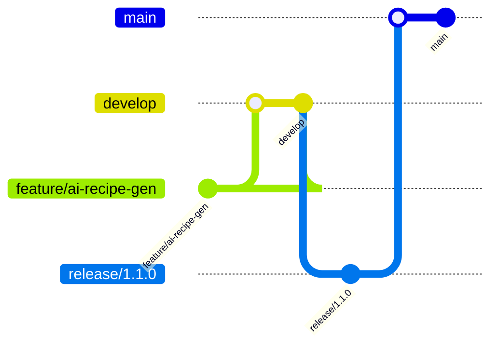

# Hestia Platform Versioning & Release Management

## 📋 Document Information
| **Document Type** | Versioning & Release Policy |
|-------------------|----------------------------|
| **Version** | 1.0.0 |
| **Last Updated** | December 28, 2024 |
| **Owner** | Release Management Team |

---

## 🏷️ Versioning Principles
- **Semantic Versioning (SemVer)**: MAJOR.MINOR.PATCH (e.g., 2.1.0)
- **Backward Compatibility**: MINOR and PATCH releases must not break existing clients
- **Breaking Changes**: Only allowed in MAJOR releases, must be documented and communicated
- **Deprecation Policy**: Features/APIs deprecated in MINOR releases, removed in next MAJOR
- **Versioning Scope**: Applies to code, APIs, database, and documentation

---

## 🔢 Semantic Versioning (SemVer)
- **MAJOR**: Incompatible API changes, major new features, or architectural overhauls
- **MINOR**: Backward-compatible feature additions or improvements
- **PATCH**: Backward-compatible bug fixes, security patches, or documentation updates

### **Examples**
| Version | Description |
|---------|-------------|
| 1.0.0 | Initial public release |
| 1.1.0 | Add new recipe analytics feature |
| 1.1.1 | Fix bug in ingredient search |
| 2.0.0 | Overhaul API authentication (breaking change) |

---

## 🌳 Branching Strategy
- **main**: Stable, production-ready code
- **develop**: Integration branch for features and fixes
- **feature/*, bugfix/*, hotfix/**: Short-lived branches for specific work
- **release/**: Prepares a new production release

### **Workflow Diagram**

---

## 📦 Release Process
1. **Feature Complete**: All tasks for a release are done and tested
2. **Code Freeze**: No new features, only bug fixes
3. **Release Candidate**: Deploy to staging, run full regression
4. **Release Approval**: Stakeholder sign-off
5. **Production Release**: Merge to main, tag version, deploy
6. **Changelog Update**: Document all changes
7. **Post-Release Monitoring**: Track metrics and issues

---

## 📝 Changelog Management
- **CHANGELOG.md**: Maintained in root, updated for every release
- **Format**: Follows [Keep a Changelog](https://keepachangelog.com/en/1.0.0/)
- **Automation**: Changelog generation via CI/CD tools

---

## 🔗 API Versioning
- **URI Versioning**: /api/v1/recipes, /api/v2/recipes
- **Header Versioning**: Accept-Version: v1
- **Deprecation**: Old versions supported for 6 months after new MAJOR
- **Backward Compatibility**: Maintained for all MINOR and PATCH

---

## 🗄️ Database Versioning
- **Migration Scripts**: All schema changes via versioned migrations
- **Rollback Support**: All migrations reversible
- **Version Table**: Track current schema version in DB
- **Release Coordination**: DB and app versions must be compatible

---

## 📚 Documentation Versioning
- **Docs per Release**: Each release has a docs snapshot
- **Versioned URLs**: /docs/v1.0.0/overview, /docs/v2.0.0/overview
- **Deprecation Notices**: Mark deprecated docs

---

## 🛡️ Versioning Policies
- **Breaking Changes**: Only in MAJOR, must be approved and documented
- **Deprecation**: Announced in MINOR, removed in next MAJOR
- **Backward Compatibility**: Maintained for MINOR/PATCH
- **Hotfixes**: Released as PATCH

---

## 🕒 Version History
| Version | Date | Description |
|---------|------|-------------|
| 1.0.0 | 2024-12-28 | Initial documentation and planning |
| ... | ... | ... |

---

*This document governs all versioning and release management for the Hestia platform. All teams must adhere to these policies.* 