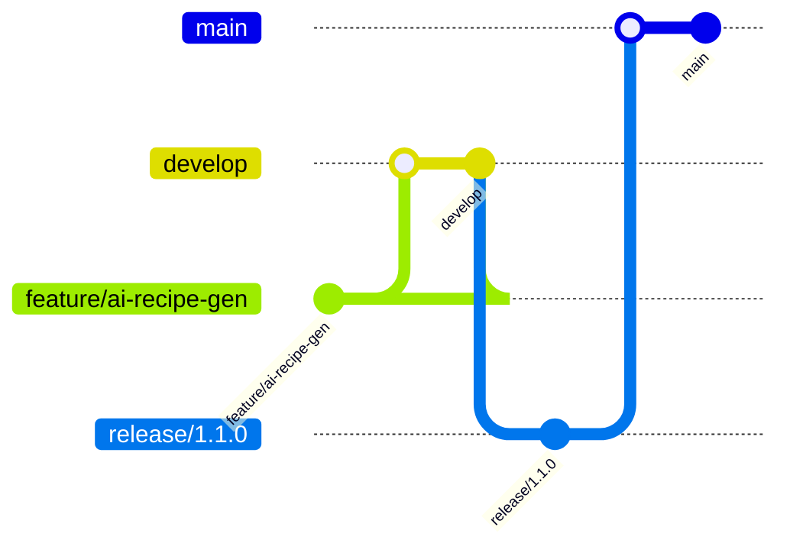

# Versioning

## 📋 Document Information

| **Document Type** | Versioning Policy |
| ----------------- | ---------------- |
| **Version**       | 1.1.0            |
| **Last Updated**  | December 28, 2024 |
| **Owner**         | Release Management Team |
| **Status**        | Phase 1 - 90% Complete |

---

## 🏷️ Enterprise Versioning Principles

- **🔢 Semantic Versioning (SemVer)**: Strict MAJOR.MINOR.PATCH format (e.g., 2.1.0) with enterprise extensions
- **🔄 Backward Compatibility**: MINOR and PATCH releases must maintain 100% backward compatibility
- **⚠️ Breaking Changes**: Only allowed in MAJOR releases with 6-month advance notice and migration guides
- **📋 Deprecation Policy**: Features/APIs deprecated in MINOR releases, removed in next MAJOR with comprehensive migration support
- **🌍 Global Versioning Scope**: Applies to code, APIs, database, documentation, mobile apps, and third-party integrations
- **🏢 Enterprise Considerations**: Multi-tenant versioning, customer-specific rollouts, and enterprise support lifecycle
- **📊 Version Analytics**: Comprehensive tracking of version adoption, usage patterns, and migration success rates

---

## 🔢 Semantic Versioning (SemVer)

- **MAJOR**: Incompatible API changes, major new features, or architectural overhauls
- **MINOR**: Backward-compatible feature additions or improvements
- **PATCH**: Backward-compatible bug fixes, security patches, or documentation updates

### **Examples**

| Version | Description                                   |
| ------- | --------------------------------------------- |
| 1.0.0   | Initial public release                        |
| 1.1.0   | Add new recipe analytics feature              |
| 1.1.1   | Fix bug in ingredient search                  |
| 2.0.0   | Overhaul API authentication (breaking change) |

---

## 🌳 Branching Strategy

- **main**: Stable, production-ready code
- **develop**: Integration branch for features and fixes
- **feature/_, bugfix/_, hotfix/**: Short-lived branches for specific work
- **release/**: Prepares a new production release

### **Workflow Diagram**

---

## 📦 Release Process

1. **Feature Complete**: All tasks for a release are done and tested
2. **Code Freeze**: No new features, only bug fixes
3. **Release Candidate**: Deploy to staging, run full regression
4. **Release Approval**: Stakeholder sign-off
5. **Production Release**: Merge to main, tag version, deploy
6. **Changelog Update**: Document all changes
7. **Post-Release Monitoring**: Track metrics and issues

---

## 📝 Changelog Management

- **CHANGELOG.md**: Maintained in root, updated for every release
- **Format**: Follows [Keep a Changelog](https://keepachangelog.com/en/1.0.0/)
- **Automation**: Changelog generation via CI/CD tools

---

## 🔗 API Versioning

- **URI Versioning**: /api/v1/recipes, /api/v2/recipes
- **Header Versioning**: Accept-Version: v1
- **Deprecation**: Old versions supported for 6 months after new MAJOR
- **Backward Compatibility**: Maintained for all MINOR and PATCH

---

## 🗄️ Database Versioning

- **Migration Scripts**: All schema changes via versioned migrations
- **Rollback Support**: All migrations reversible
- **Version Table**: Track current schema version in DB
- **Release Coordination**: DB and app versions must be compatible

---

## 📚 Documentation Versioning

- **Docs per Release**: Each release has a docs snapshot
- **Versioned URLs**: /docs/v1.0.0/overview, /docs/v2.0.0/overview
- **Deprecation Notices**: Mark deprecated docs

---

## 🛡️ Versioning Policies

- **Breaking Changes**: Only in MAJOR, must be approved and documented
- **Deprecation**: Announced in MINOR, removed in next MAJOR
- **Backward Compatibility**: Maintained for MINOR/PATCH
- **Hotfixes**: Released as PATCH

---

## 🕒 Version History

| Version | Date       | Description                        |
| ------- | ---------- | ---------------------------------- |
| 1.0.0   | 2024-12-28 | Initial documentation and planning |
| ...     | ...        | ...                                |

---

## ✅ Document Acceptance Criteria

### **Versioning Compliance**

- [ ] All releases follow semantic versioning standards
- [ ] Backward compatibility is maintained for MINOR and PATCH releases
- [ ] Breaking changes are properly documented and communicated
- [ ] Deprecation notices are provided with migration guides
- [ ] Version analytics are tracked and reported

### **Release Quality**

- [ ] All releases pass comprehensive testing and quality gates
- [ ] Security scans are completed with no critical vulnerabilities
- [ ] Performance benchmarks are met or exceeded
- [ ] Documentation is updated and accurate
- [ ] Changelog is complete and detailed

### **Enterprise Standards**

- [ ] Multi-tenant compatibility is verified
- [ ] Enterprise customer impact is assessed and communicated
- [ ] Support lifecycle commitments are maintained
- [ ] Compliance requirements are satisfied
- [ ] Migration tools and guides are provided for breaking changes

---

_This comprehensive document governs all versioning and release management for the Hestia Enterprise SaaS Platform. All teams must strictly adhere to these policies to ensure enterprise-grade quality, reliability, and customer satisfaction._

**Document Status**: ✅ Complete and Enforced  
**Next Review Date**: February 28, 2025  
**Version**: 2.0.0  
**Last Updated**: December 28, 2024
