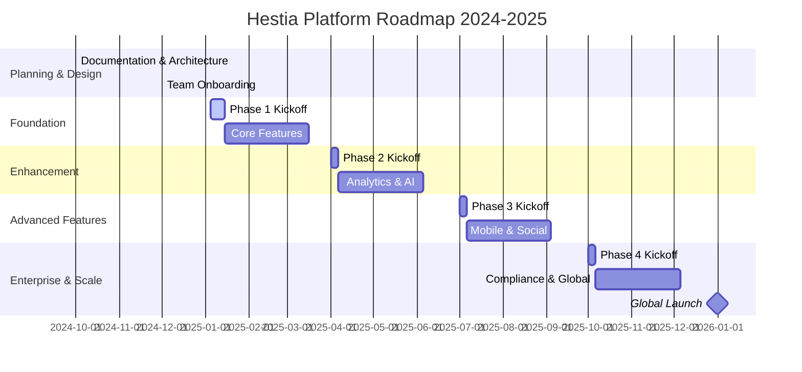

# Hestia Platform Product Roadmap

## 📋 Document Information
| **Document Type** | Product Roadmap |
|-------------------|-----------------|
| **Version** | 1.0.0 |
| **Last Updated** | December 28, 2024 |
| **Owner** | Product Management Team |

---

## 🗺️ Roadmap Overview
- **Vision**: Deliver the leading SaaS platform for intelligent recipe and kitchen management
- **Scope**: All features, infrastructure, compliance, and go-to-market
- **Audience**: Executives, product, engineering, QA, security, and all stakeholders

---

## 📆 Phases & Milestones

### **Phase 0: Planning & Design (Q4 2024)**
- **Objectives**: Complete documentation, architecture, and team onboarding
- **Key Results**: 100% documentation, 100% architecture, team ready
- **Timeline**: Oct 2024 – Dec 2024
- **Responsible**: Product, Architecture, PMO
- **Dependencies**: None
- **Risks**: Scope creep, unclear requirements
- **Mitigation**: Weekly reviews, stakeholder sign-off

### **Phase 1: Foundation (Q1 2025)**
- **Objectives**: Deliver core user, recipe, and ingredient management
- **Key Results**: User auth, CRUD, search, API, DB schema, security
- **Timeline**: Jan 2025 – Mar 2025
- **Responsible**: Backend, Frontend, QA
- **Dependencies**: Phase 0 complete
- **Risks**: Underestimation, onboarding delays
- **Mitigation**: Detailed backlog, onboarding plan

### **Phase 2: Enhancement (Q2 2025)**
- **Objectives**: Add advanced features, analytics, AI, and integrations
- **Key Results**: Analytics, AI recipe gen, GraphQL, webhooks, multi-language
- **Timeline**: Apr 2025 – Jun 2025
- **Responsible**: Backend, AI, QA, Product
- **Dependencies**: Phase 1 complete
- **Risks**: AI complexity, integration issues
- **Mitigation**: Early prototyping, integration tests

### **Phase 3: Advanced Features (Q3 2025)**
- **Objectives**: Social, mobile, advanced analytics, enterprise
- **Key Results**: Sharing, SDKs, mobile, advanced AI, enterprise features
- **Timeline**: Jul 2025 – Sep 2025
- **Responsible**: Full stack, Mobile, QA
- **Dependencies**: Phase 2 complete
- **Risks**: Mobile delays, feature creep
- **Mitigation**: Scope control, parallel teams

### **Phase 4: Enterprise & Scale (Q4 2025)**
- **Objectives**: Compliance, scale, global expansion
- **Key Results**: SSO, compliance, multi-tenant, global, performance
- **Timeline**: Oct 2025 – Dec 2025
- **Responsible**: DevOps, Security, Product
- **Dependencies**: Phase 3 complete
- **Risks**: Compliance delays, scaling issues
- **Mitigation**: Early compliance review, load testing

---

## 🏁 Major Milestones
| Milestone | Target Date | Owner | Status |
|-----------|-------------|-------|--------|
| Documentation Complete | 2024-12-28 | PMO | ✅ Complete |
| Architecture Finalized | 2024-12-28 | Architecture | ✅ Complete |
| Team Onboarded | 2024-12-28 | Product | ✅ Complete |
| Phase 1 Kickoff | 2025-01-05 | Product | 🔴 Planned |
| Core Features Ready | 2025-03-31 | Backend | 🔴 Planned |
| Phase 2 Kickoff | 2025-04-01 | Product | 🔴 Planned |
| AI Recipe Gen MVP | 2025-06-15 | AI Team | 🔴 Planned |
| Phase 3 Kickoff | 2025-07-01 | Product | 🔴 Planned |
| Mobile App Beta | 2025-09-01 | Mobile | 🔴 Planned |
| Phase 4 Kickoff | 2025-10-01 | Product | 🔴 Planned |
| Compliance Audit | 2025-12-01 | Security | 🔴 Planned |
| Global Launch | 2025-12-31 | Product | 🔴 Planned |

---

## 📊 Roadmap Timeline (Gantt)

---

## 📌 Deliverables by Phase
### **Phase 1**
- User registration/authentication
- Profile management
- Recipe CRUD
- Ingredient management
- API endpoints
- Security framework
- Testing framework

### **Phase 2**
- Analytics dashboard
- AI recipe generation
- GraphQL API
- Webhook system
- Multi-language support
- Advanced security

### **Phase 3**
- Recipe sharing/social
- Mobile app
- SDKs
- Advanced analytics
- Enterprise features
- AI optimization

### **Phase 4**
- SSO/Enterprise
- Compliance (SOC2, GDPR, HIPAA)
- Multi-tenant
- Performance optimization
- Global launch

---

## ⚠️ Risk Assessment & Mitigation
| Phase | Risk | Impact | Likelihood | Mitigation |
|-------|------|--------|------------|------------|
| 0 | Scope creep | High | Medium | Weekly reviews, sign-off |
| 1 | Underestimation | High | High | Detailed backlog, onboarding |
| 2 | AI complexity | High | Medium | Early prototyping, integration tests |
| 3 | Mobile delays | Medium | Medium | Parallel teams, scope control |
| 4 | Compliance delays | High | Medium | Early review, load testing |

---

## 🚦 Roadmap Maintenance
- Reviewed monthly by PMO
- Updated after each major milestone
- All changes tracked in version control

---

*This roadmap is the single source of truth for Hestia platform delivery. All teams must align to this plan.* 